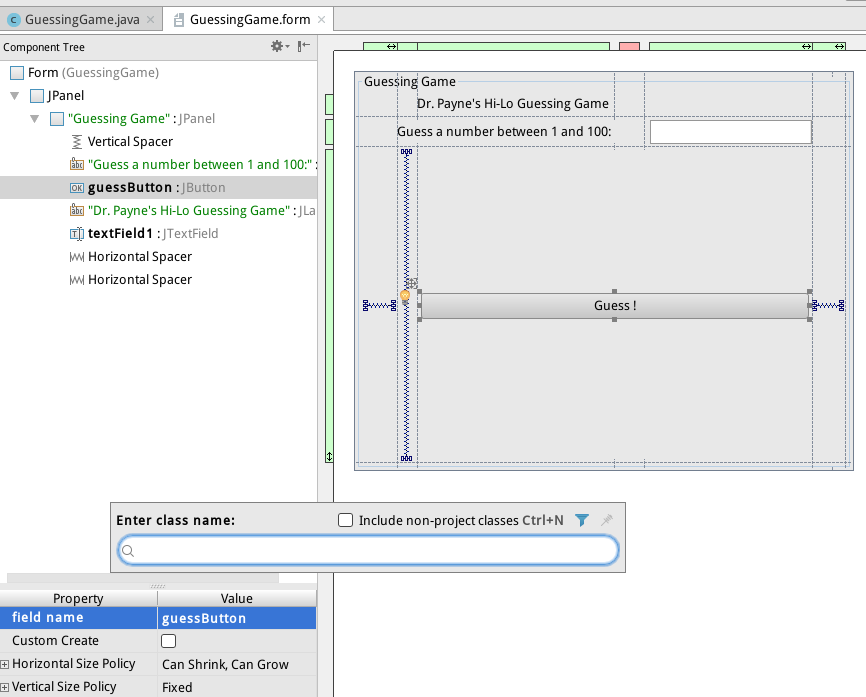

# GUI交互的GuessigGame

在Jetbrain Idea中创建新项目`GuessingGame`，不使用任何模板。

* 在`src`目录，右击，选择`New > Java Class`

由于是一个stand-alone程序，所以需要添加`public static void main(String[] args)`:

```java
import javax.swing.JFrame

public class GuessingGame extends JFrame {
    public static void main(String[] args) {
        
    }
}
```

`GuessingGame`的`extends`关键字继承了父类`JFrame`。在这个案例中，`JFrame`父类可以显示文本字段，标签，按钮以及其他GUI组件，这些组件都可以在`GuessingGame`应用中定制。

# JetBrain IntelliJ IDEA的GUI设计

> [IDEA的设计概念](https://www.jetbrains.com/help/idea/gui-designer-basics.html)中，GUI form不是Java classes，而是存储在项目中以`.form`扩展的XML文件。

IDEA的GUI Designer使得开发者能够以期望的布局和绑定类以及对话来创建GUI form。一个form可以仅仅使用文件来船舰，也可以结合一个UI class。一个对话框架包含了定义基本组件和方式的类，并且具有各个组件的GUI form绑定了各个字段的UI class。

在创建GUI form和dialog之前，选择一个将要存储form的包。可能需要首先创建一个包，建议将from和dialog作为实现它们功能的类存储在同一个包里面。

和Eclipse不同，IDEA的GUI Designer通过交互界面创建窗口之后，可以使用组合键 `Alt+Insert`（Windows）或者`ctrl+n`(MacOS)  就可以对窗体绑定class。此时会弹出一个对话框，用于输入绑定的类：



> 参考[Creating and Disposing of a Form's Runtime Frame](https://www.jetbrains.com/help/idea/creating-and-disposing-of-a-form-s-runtime-frame.html)和[What is the equivalent of “Alt-Insert” in IntelliJ for Mac OS X?](https://stackoverflow.com/questions/12405564/what-is-the-equivalent-of-alt-insert-in-intellij-for-mac-os-x)

## 绑定

# 参考

* [IntelliJ IDEA 2017.3 Help: Creating and Opening Forms](https://www.jetbrains.com/help/idea/creating-and-opening-forms.html)