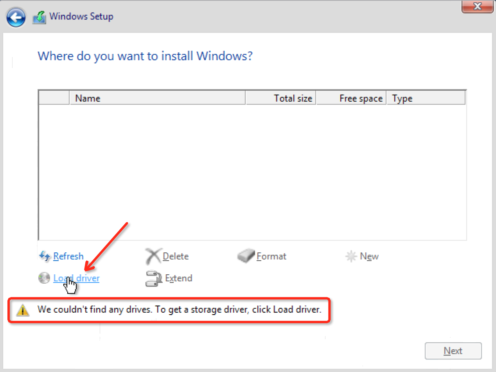

在[在CentOS中部署KVM](../startup/in_action/deploy_kvm_on_centos)介绍了使用`virtio`启动安装Windows的方法：

```
virt-install \
   --name=win2016desktop \
   --virt-type=kvm \
   --boot cdrom,hd \
   --os-type=windows \
   --network=default,model=virtio \
   --disk path=/var/lib/libvirt/images/win2016desktop.img,size=16,format=qcow2,bus=virtio,cache=none \
   --cdrom=/var/lib/libvirt/images/win2016.iso \
   --graphics vnc --ram=2048 \
   --vcpus=2
```

这里需要注意的是，Windows自身是没有携带`virtio`驱动的，所以此时安装选择目标磁盘时候会看不到虚拟磁盘：

