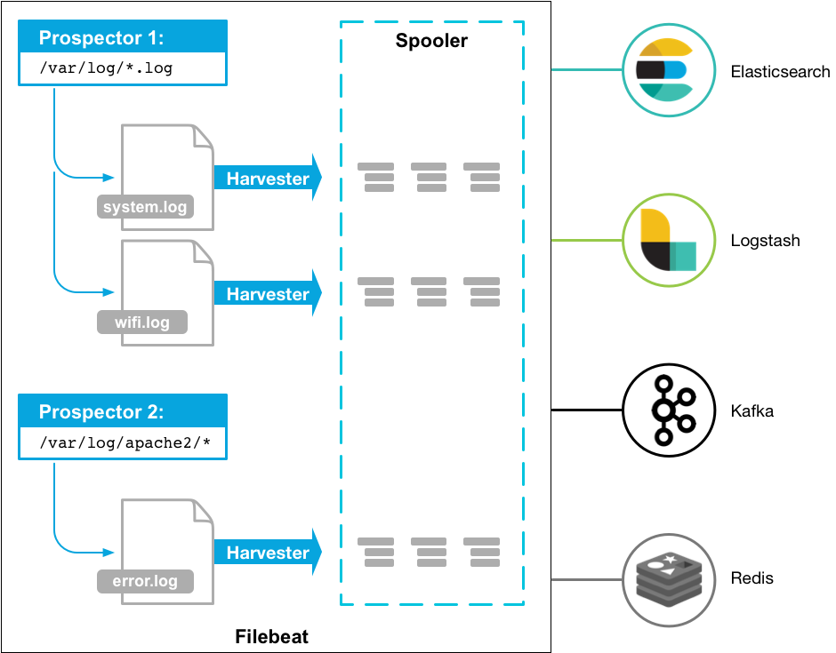

# 实现概述

ESK的简单架构如下：

* `Logstash`: 服务端用于接收处理日志
* `Elasticsearch`: 存储所有日志
* `Kibana`: 用于搜索和可视化日志，访问是通过Nginx反向代理
* `Filebeat`: 在采集日志的服务器上安装客户端程序，将日志发送给Logstash，Filebeat服务是一个日志消费代理，使用`lumberjack`网络协议和Logstash通讯


# 环境要求

Elasticsearch运行要求Java 8，建议使用Oracle JDK version 1.8.0_131。可以从[Oralce官方网站](http://docs.oracle.com/javase/8/docs/technotes/guides/install/install_overview.html)下载。

* 安装Java运行环境

```
rpm -ivh jre-8u161-linux-x64.rpm
```

> 本文实践在CentOS 7平台完成

# Elasticsearch

## 安装Elasticsearch

在Linux平台安装Elasticsearch使用[tar](https://www.elastic.co/guide/en/elasticsearch/reference/6.2/zip-targz.html)包安装，下载页面如下：

https://www.elastic.co/downloads/elasticsearch

在CentOS/RHEL环境也可以使用官方仓库进行安装（参考[Repositories RPM](https://www.elastic.co/guide/en/elasticsearch/reference/current/rpm.html)），各软件包安装使用的是相同的软件仓库（官方安装文档中对每个安装包使用了不同的repo文件命名，实际内容相同），以下为软件仓库配置生成方法：

```
rpm --import https://artifacts.elastic.co/GPG-KEY-elasticsearch

cat << EOF > /etc/yum.repos.d/elasticsearch.repo
[elasticsearch-6.x]
name=Elasticsearch repository for 6.x packages
baseurl=https://artifacts.elastic.co/packages/6.x/yum
gpgcheck=1
gpgkey=https://artifacts.elastic.co/GPG-KEY-elasticsearch
enabled=1
autorefresh=1
type=rpm-md
EOF
```

安装Elasticsearch

```
yum install elasticsearch
```

## 运行Elasticsearch

* 设置Elasticsearch在系统启动时启动

```
sudo /bin/systemctl daemon-reload
sudo /bin/systemctl enable elasticsearch.service
```

* 启动服务

```
sudo systemctl start elasticsearch.service
sudo systemctl stop elasticsearch.service
```

* 检查服务状态

```
sudo systemctl status elasticsearch.service
```

* 检查服务日志

```
sudo journalctl --unit elasticsearch
```

也可以检查给定时间之后的日志

```
sudo journalctl --unit elasticsearch --since  "2016-10-30 18:17:16"
```

* 检查Elasticsearch运行

```
curl -XGET 'localhost:9200/?pretty'
```

输出显示类似：

```json
{
  "name" : "LNTJfDI",
  "cluster_name" : "elasticsearch",
  "cluster_uuid" : "kDHelU95SVq9-kDsOvBE7g",
  "version" : {
    "number" : "6.2.3",
    "build_hash" : "c59ff00",
    "build_date" : "2018-03-13T10:06:29.741383Z",
    "build_snapshot" : false,
    "lucene_version" : "7.2.1",
    "minimum_wire_compatibility_version" : "5.6.0",
    "minimum_index_compatibility_version" : "5.0.0"
  },
  "tagline" : "You Know, for Search"
}
```

# 配置Elasticsearch

在`/etc/elasticsearch`目录下保存了Elasticsearch相关配置，默认加载`/etc/elasticsearch/elasticsearch.yml`配置。

# Kibana

## 安装Kibana

```
yum install kibana
```

## 运行Kibana

* 在系统启动时启动Kibana

```
sudo /bin/systemctl daemon-reload
sudo /bin/systemctl enable kibana.service
```

* 运行Kibana

```
sudo systemctl start kibana.service
sudo systemctl stop kibana.service
```

## 配置Kibana

Kibana的配置文件是`/etc/kibana/kibana.yml`

## 访问Kibana

Kibana是一个Web程序(node程序)，端口5601。为了能够直接访问，我们安装Nginx作为Web的反向代理服务器。

## 安装Nginx

* 添加EPEL软件仓库：

```
sudo yum -y install epel-release
```

* 安装Nginx和httpd-tools:

```
sudo yum -y install nginx httpd-tools
```

* 使用`htpasswd`创建一个管理用户，这里命名为`kianaadmin`

```
sudo htpasswd -c /etc/nginx/htpasswd.users kibanaadmin
```

* 编辑`/etc/nginx/nginx.conf`，确保包含了如下内容：

```
    include /etc/nginx/conf.d/*.conf;
}
```

* 创建`/etc/nginx/conf.d/kibana.conf`配置如下

```
server {
    listen 80;

    server_name example.com;

    auth_basic "Restricted Access";
    auth_basic_user_file /etc/nginx/htpasswd.users;

    location / {
        proxy_pass http://localhost:5601;
        proxy_http_version 1.1;
        proxy_set_header Upgrade $http_upgrade;
        proxy_set_header Connection 'upgrade';
        proxy_set_header Host $host;
        proxy_cache_bypass $http_upgrade;        
    }
}
```

* 启动Nginx

```
sudo systemctl start nginx
sudo systemctl enable nginx
```

现在就能够通过域名`example.com`访问我们构建的模拟网站


## Sense

[Sense](https://github.com/elastic/sense)是Kibana应用的插件，可以方便通过浏览器和Elasticsearch交互。

从Kibana 5.0开始Sense已经包含在Console中，参考[sense/README.md](https://github.com/elastic/sense/blob/master/README.md)，不需要单独安装了。

可以直接通过

http://localhost:5601/app/kibana#/dev_tools/console 

访问，提供了交互方式查询数据的界面

# Logstash

## 安装Logstash

```
yum install logstash
```

此时logstash已经安装完成但尚未配置。

* 启动

```
sudo systemctl start logstash.service
```

* 激活操作系统启动时启动logstash

```
sudo systemctl enable logstash.service
```

# SSL认证

> Elastic提供了[Beat](https://www.elastic.co/downloads/beats)组合用来分析复杂的数据，例如`Packetbeat`可以分析网络数据，`Matricbeat`可以通过网状分析链路

在使用Filebeat上传日志之前，需要创建SSL证书和密钥对。证书是Filebeat用来验证ELK服务器的标识。

有两种方式提供设置证书，一种是采用DNS设置，允许客户端解析ELK服务器的IP，另一种是直接使用IP地址。

> 在小规模的测试环境中，可以采用`/etc/hosts`绑定IP解析的方法，以便使用域名。后期扩容就可以方便地改造成DNS解析方法。

* 选项1:使用IP地址

将ELK服务器的私有地址设置为SSL证书对`subjectAltName`(SAN)字段：方法是编辑`/etc/pki/tls/openssl.conf`文件，找到文件中`[ v3_ca ]`段落，并添加如下行（）

```
subjectAltName = IP: 192.168.0.21
```

> 这里`192.168.0.21`是测试环境中`logstash`服务器的IP地址

然后执行以下命令在相应位置（`/etc/pki/tls`目录下）生成SSL证书和私钥：

```
cd /etc/pki/tls
sudo openssl req -config /etc/pki/tls/openssl.cnf -x509 -days 3650 -batch -nodes -newkey rsa:2048 -keyout private/logstash-forwarder.key -out certs/logstash-forwarder.crt
```

> 这里`logstash-forwarder.crt`文件是分发给所有需要向`logstash`发送日志的服务器。

* 选项2:使用DNS（FQDN）

如果在私有网络中使用了DNS设置，在采用域名解析方式：

```
cd /etc/pki/tls
sudo openssl req -subj '/CN=elk-logstash.example.com/' -x509 -days 3650 -batch -nodes -newkey rsa:2048 -keyout private/logstash-forwarder.key -out certs/logstash-forwarder.crt
```

> 这里`elk-logstash.example.com`是测试环境的`logstash`服务器的FQDN域名解析，请替换成实际服务器的域名。生成的`logstash-forwarder.crt`文件是分发给所有需要向`logstash`发送日志的服务器。

## 配置Logstash

Logstash配置文件是`JSON`格式，位于`/etc/logstash/conf.d`。

* 创建一个名为`02-beats-input.conf`并设置`filebeat`输入：

```
input {
  beats {
    port => 5044
    ssl => true
    ssl_certificate => "/etc/pki/tls/certs/logstash-forwarder.crt"
    ssl_key => "/etc/pki/tls/private/logstash-forwarder.key"
  }
}
```

这里设置`beats`输入监听在端口`5044`，并且使用SSL证书和私钥。

* 创建一个名为`10-syslog-filter.conf`用于添加`syslog`消息的过滤器：

```
filter {
  if [type] == "syslog" {
    grok {
      match => { "message" => "%{SYSLOGTIMESTAMP:syslog_timestamp} %{SYSLOGHOST:syslog_hostname} %{DATA:syslog_program}(?:\[%{POSINT:syslog_pid}\])?: %{GREEDYDATA:syslog_message}" }
      add_field => [ "received_at", "%{@timestamp}" ]
      add_field => [ "received_from", "%{host}" ]
    }
    syslog_pri { }
    date {
      match => [ "syslog_timestamp", "MMM  d HH:mm:ss", "MMM dd HH:mm:ss" ]
    }
  }
}
```

这个过滤器检查（通过Filebeat）标记为`syslog`的日志，并使用`grok`来解析传入的syslog日志，并将其结构化和可查询化。

* 最后创建`30-elasticsearch-output.conf`

```
output {
  elasticsearch {
    hosts => ["localhost:9200"]
    sniffing => true
    manage_template => false
    index => "%{[@metadata][beat]}-%{+YYYY.MM.dd}"
    document_type => "%{[@metadata][type]}"
  }
}
```

上述基本配置使得logstash存储beats数据到Elasticsearch（运行在`localhost:9200`）。

如果要使用Filebeat输入来添加其他应用程序的过滤器，需要确保文件名命名的顺序位于`input`和`output`配置文件之间（例如，在`02-`和`30-`文件名之间）

* 测试配置文件是否正确：

```
sudo service logstash configtest
```

> 这条命令不知道如何验证，在CentOS7 systemd环境下应该有所不同

## Logstash 使用 grok 过滤

日志数据一般都是非结构化数据，而且包含很多不必要的信息，所以需要在 Logstash 中添加过滤插件对 Filebeat 发送的数据进行结构化处理。

使用 grok 正则匹配把那些看似毫无意义、非结构化的日志数据解析成可查询的结构化数据，是目前 Logstash 解析过滤的最好方式。

Grok 的用户不需要从头开始写正则。ELK github 上已经写好了很多有用的模式，比如日期、邮箱地址、IP4/6、URL 等。具体可参考[logstash-patterns-core/patterns/grok-patterns](https://github.com/logstash-plugins/logstash-patterns-core/blob/master/patterns/grok-patterns)。除此之外，还有 [grok 正则表达式的debug 在线工具](http://grokdebug.herokuapp.com/)，能方便快速检验所写表达式是否正确。

# Filebeat

## Beats简介

[Beats](https://www.elastic.co/products/beats)是轻量级的数据投递器（lightweight data shippers），采用Go语言编写，安装在需要捕获各种操作数据的服务器上（如 日志，metrics或网络包数据）。Beats将操作数据发送给Elasticsearch，直接或间接通过Logstash采集，这样就能够通过Kibana实现可视化。

官方提供的Beats:

| Beat | 说明 |
| ---- | ---- |
| [Filebeat](https://github.com/elastic/beats/tree/master/filebeat) | tail和发送日志文件 |
| [Heartbeat](https://github.com/elastic/beats/tree/master/heartbeat) | ping远程服务可用性 |
| [Metricbeat](https://github.com/elastic/beats/tree/master/metricbeat) | 从操作系统和服务获取metric集 |
| [Packbeat](https://github.com/elastic/beats/tree/master/packetbeat) | 通过包嗅探监控网络和应用程序 |
| [Winlogbeat](https://github.com/elastic/beats/tree/master/winlogbeat) | Windows事件日志获取 |

## 安装Filebeat

> 需要采集日志的服务器上安装[Filebeat](https://www.elastic.co/guide/en/beats/filebeat/current/index.html)

Filebeat作为代理在服务器上运行，监视日志目录或指定日志文件，tail这些日志文件，并将内容转发给[Elasticsearch](https://www.elastic.co/products/elasticsearch)或[Logstash](https://www.elastic.co/products/logstash)进行索引。

当启动Filebeat之后，Filebeat就会启动一个或多个探测器（prospector）来检查指定日志文件的本地路径。对于每个被探测器锁定的日志文件，Filebeat都会启动一个收割机（harvester）。每个harvester读取日志文件的新内容，并将新的日志数据发送给`libbeat`，然后油`libbeat`聚合事件再把聚合数据输出给你所配置的Filebeat。



> Filebeat也是一个[Beat](https://www.elastic.co/products/beats)，并且基于`libbeat`框架开发。

* 安装Filebeat

> 注意：在采集服务器上也如同

```
yum install filebeat
```

或者手工安装(例如在CentOS 5上安装)

```
curl -L -O https://artifacts.elastic.co/downloads/beats/filebeat/filebeat-6.2.3-x86_64.rpm
sudo rpm -vi filebeat-6.2.3-x86_64.rpm
```

> 在CentOS 5上安装rpm包时，需要使用`rpm --nosignature -ivh filebeat-6.2.3-x86_64.rpm`

## 配置Filebeat连接所使用的SSL证书

在每个需要传输日志的服务器上都要复制SSL证书（前面已经在ELK服务器上生成的SSL证书）

* 先将证书分发到采集日志的服务器的/tmp目录下

```
scp /etc/pki/tls/certs/logstash-forwarder.crt user@client_server_private_address:/tmp
```

* 然后在采集日志服务器上执行如下命令将证书存放到`/etc/pki/tls/certs/`目录下

```
sudo mkdir -p /etc/pki/tls/certs
sudo cp /tmp/logstash-forwarder.crt /etc/pki/tls/certs/
```

## 配置Filebeat

对于使用rpm或deb安装的Filebeat，配置文件位于`/etc/filebeat/filebeat.yml`。如果是Docker运行，则位于`/usr/share/filebeat/filebeat.yml`。完整的配置文件案例是`filebeat.reference.yml`。

> 在`/etc/filebeat/modules.d`目录中，有系统已经准备好的常用服务的日志采集案例配置文件（默认禁用）

* 配置采集系统日志（对应前述的logstrash中配置的`10-syslog-filter.conf`）

```yaml
filebeat.prospectors:
- type: log
  enabled: true
      paths:
        - /var/log/secure
        - /var/log/messages
#        - /var/log/*.log
```

> 这里`type:`有两种，一种是`log`，一种是`stdin`

另外，参考[How To Install Elasticsearch, Logstash, and Kibana (ELK Stack) on CentOS 7](https://www.digitalocean.com/community/tutorials/how-to-install-elasticsearch-logstash-and-kibana-elk-stack-on-centos-7)，似乎应该还要修改一个`document_type`类似如下，但是在最新的版本中找不到这个选项（待查）：

```
      document_type: syslog
```

* 自定义日志：假设需要监控`/home/admin/virtman/log`目录下日志

```yaml
filebeat.prospectors:
- type: log
  enabled: true
  paths:
    - /home/admin/virtman/log/*.log
```

上述设置Filebeat监视`/home/admin/virtman/log`目录下所有`.log`后缀的日志文件（单层目录）。如果要递归监视所有子目录，则配置`/home/admin/virtman/log/*/*.log`。

* 配置输出

直接发送给Elasticsearch（不使用Logstash），则没有任何过滤和数据再加工

```
#-------------------------- Elasticsearch output ------------------------------
output.elasticsearch:
  hosts: ["192.168.0.21:9200"]
```

(我采用这个方法)更好的方式是采用Logstash来处理日志，此时要禁止掉上述直接输出给Elasticsearch的配置，改成如下配置：

```
#----------------------------- Logstash output --------------------------------
output.logstash:
  hosts: ["192.168.0.21:5044"]
```

> 配置输出给Logstash就可以实现复杂的数据过滤处理（见前述`配置Logstash`），详细参考 [Configure Filebeat to use Logstash](https://www.elastic.co/guide/en/beats/filebeat/current/config-filebeat-logstash.html)

* (可选，我暂时没有配置)在`hosts`段落，配置缓存队列，设置如下：

```
    bulk_max_size: 1024
```

* 配置访问证书

```
#----------------------------- Logstash output --------------------------------
output.logstash:
  hosts: ["192.168.0.21:5044"]

  # Optional SSL. By default is off.
  # List of root certificates for HTTPS server verifications
  #ssl.certificate_authorities: ["/etc/pki/root/ca.pem"]
  certificate_authorities: ["/etc/pki/tls/certs/logstash-forwarder.crt"]
```

* 启动Filebeat

```
sudo systemctl start filebeat
sudo systemctl enable filebeat
```

## Filebeat 实现 log rotation

Filebeat 默认支持 log rotation，但需要注意的是，Filebeat 不支持使用 NAS 或挂载磁盘保存日志的情况。因为在 Linux 系列的操作系统中，Filebeat 使用文件的 inode 信息判断当前文件是新文件还是旧文件。如果是 NAS 或挂载盘，同一个文件的 inode 信息会变化，导致 Filebeat 无法完整读取 log。


# Kibana配置模版

* 在Elasticsearch中加载索引模版

在Elasticsearch中，[索引模版](https://www.elastic.co/guide/en/elasticsearch/reference/6.2/indices-templates.html)是用来定义设置和映射哪些字段需要分析。

通过Filebeat软件包已经为Filebeat安装了建议的索引模版。如果你接受`filebeat.yml`配置文件的默认配置，Filebeat会在成功连接到Elasticsearch时候自动加载模版。如果模版已经存在，Filebeat不会覆盖它，除非你配置Filebeat这样做。

你可以在Filebeat配置中通过配置模版加载选项，禁止自动加载模版，或者加载你自己定义的模版。

* 配置模版加载

默认情况下，如果激活了Elasticsearch output，则Filebeat会自动加载模版文件`fields.yml`

可以修改默认的`filebeat.yml`配置文件加载不同的模版：

```
setup.template.name: "your_template_name"
setup.template.fields: "path/to/fields.yml"
```

## codecs： 格式化日志数据 

在 Logstash 中， [codec](https://www.elastic.co/guide/en/logstash/current/codec-plugins.html)（ 源自 `coder`/`decoder` 两个单词的首字母缩写）插件可用于格式化日志数据处理。 `codec`可使得Logstash更方便地与其他自定义数据格式的产品共存，如`graphite`（ 开源的存储图形化展示的组件）、`fluent`、 `netflow`、 `collectd`（ 守护进程， 是一种收集系统性能和提供各种存储方式来 存储不同值的机制）， 以及使用`msgpack`、`json` 等通用数据格式的其他产品。


# 参考

* [Elasticsearch Reference [6.2] » Getting Started » Installation](https://www.elastic.co/guide/en/elasticsearch/reference/current/_installation.html)
* [How To Install Elasticsearch, Logstash, and Kibana (ELK Stack) on CentOS 7](https://www.digitalocean.com/community/tutorials/how-to-install-elasticsearch-logstash-and-kibana-elk-stack-on-centos-7)
* [ELK+Filebeat 集中式日志解决方案详解](https://www.ibm.com/developerworks/cn/opensource/os-cn-elk-filebeat/index.html)