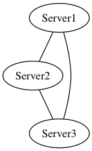
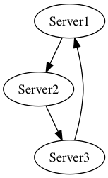

# `一图胜千言`

对于复杂的计算机系统，`一图胜千言`是非常有效的格言。随着系统越来越复杂，绘制系统的示意图并且文档化变得越来越重要。[Graphviz](http://www.graphviz.org)是一个灵活的用于创建示意图并且易于脚本化的程序。

本文是诊断IBM Power服务的Virtual I/O Server(VIOS) NPIV 和 VIOS VSCSI 架构脚本，并使用脚本用于生成图形提供诊断。

> 可以参考使用 [Python Graphviz模块](../../python/startup/python_graphviz) 来实现类似功能，例如，作为在线系统故障诊断的图形展示。

# 获取Graphviz

Graphviz是一个开源工具，并且支持多种Unix平台，甚至可以运行在Windows上。可以从 [Graphviz官网](http://www.graphviz.org/) 下载安装可执行软件包。

Linux发行版可以直接安装，如RHEL/Fedora/CentOS可以使用 `yum install graphviz` 安装。

# DOT语言基础

DOT文件是一个描述图形元素和元素关系的文本文件，所以可以用文本编辑器创建一个`.dot`文件，例如`example1.dot`:

```
graph example1 {
Server1 -- Server2
Server2 -- Server3
Server3 -- Server1
}
```

以上dot文件描述了3个服务器节点，`--`定义了节点之间的连接。

使用以下命令将图形转换成`png`文件：

```
dot example1.dot -Tpng -o example1.png
```



如果要将连接线替换成箭头，则使用`->`替换`--`

```
digraph example2 {
Server1 -> Server2
Server2 -> Server3
Server3 -> Server1
}
```

> 注意：对于使用箭头的流程图，需要将`graph`调整成`diagraph`



DOT也支持复杂的图形和标注，举例：

```
digraph example3 {
Server1 -> Server2
Server2 -> Server3
Server3 -> Server1
 
Server1 [shape=box, label="Server1\nWeb Server", fillcolor="#ABACBA", style=filled]
Server2 [shape=triangle, label="Server2\nApp Server", fillcolor="#DDBCBC", style=filled]
Server3 [shape=circle, label="Server3\nDatabase Server", fillcolor="#FFAA22",style=filled]
}
```

* 设置默认图形

Graphviz默认图形是椭圆，如果要设置默认图形，如矩形，则使用`node`

```
digraph ExampleGraph
{
    node [shape="box"];

    a -> b -> c -> d;
}
```

# 使用脚本创建Graphviz示意图

以下脚本通过连接到硬件管理控制台（Hardware Management Console, HMC）并获取被管理服务器和逻辑分区（LPARs）信息，并创建DOT输出：

```
#!/bin/bash
 
HMC="$1"
 
serverlist=`ssh -q -o "BatchMode yes" $HMC lssyscfg -r sys -F "name" | sort`
 
echo "graph hmc_graph{"
 
for server in $serverlist; do
    echo " \"$HMC\" -- \"$server\" "
    lparlist=`ssh -q -o "BatchMode yes" $HMC lssyscfg -m $server -r lpar -F "name" | sort`
    for lpar in $lparlist; do
             echo "    \"$server\" -- \"$lpar\" "
    done
done
 
echo "}"
```

例如`./hmc_to_dot.sh hmc_name`输出内容

```
graph hmc_graph{
 "hmc01" -- "test520"
    "test520" -- "lpar2"
    "test520" -- "lpar3"
 "hmc01" -- "test570"
    "test570" -- "aixtest01"
    "test570" -- "aixtest02"
    "test570" -- "aixtest03"
 "hmc01" -- "test510"
    "test510" -- "lpar1"
}
```

可以通过以下命令获取图形

```
./hmc_to_dot.shhmc_server_name|dot-Tpng-ohmc_graph.png
```

# 参考

* [Using Graphviz to generate automated system diagrams](https://www.ibm.com/developerworks/aix/library/au-aix-graphviz/)
* [An Introduction to GraphViz and dot](http://www.linuxdevcenter.com/pub/a/linux/2004/05/06/graphviz_dot.html)
* [How to set default node shape to box instead of oval?](https://stackoverflow.com/questions/26553273/how-to-set-default-node-shape-to-box-instead-of-oval)