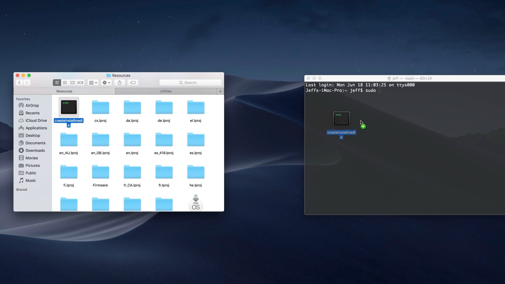
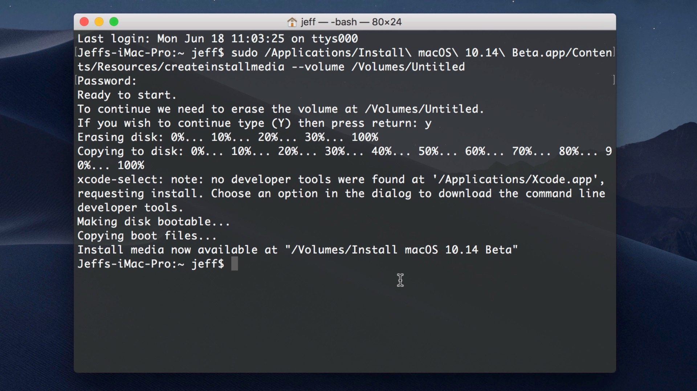

Mac OS X支持在线安装操作系统：在按下电源的同时安装`option`建，就可以选择无线网络，通过在线方式启动进行安装恢复操作系统，不需要使用传统的安装U盘。不过，有时候为了能够方便反复安装，也可以现在OS X系统制作U盘。

从App Store下载的操作系统，是存储在本机的，需要转换到U盘。

# macOS EL Capitan

* 重命名U盘:

可以使用Disk Utility工具将U盘格式化成一个命名为`ElCapInstaller`的U盘符

* 在终端输入如下命令创建启动安装U盘

```bash
sudo /Applications/Install\ OS\ X\ El\ Capitan.app/Contents/Resources/createinstallmedia --volume /Volumes/ElCapInstaller --applicationpath /Applications/Install\ OS\ X\ El\ Capitan.app --nointeraction
```

> 最新的macOS 10.14（Mojave）已经不能使用上述命令方法（不支持`--applicationpath`参数），使用上述方法创建U盘安装过程会提示需要升级硬盘中的系统，但是实际上无法成功。

# macOS Mojave创建安装U盘

* 打开文件管理器Finder，然后访问Applications，并右击`Install macOS 10.14`图标，选择`Show Package Contents`
* 打开Contents -> Resources
* 通过Finder管理器的`Applications → Utilities → Terminal`菜单打开终端程序
* 在中断窗口中输入`sudo`，然后将`createinstallmedia`拖放到终端窗口



* 然后在终端窗口中的命令继续输入`--volume`和一个宫格
* 打开Finder -> Go -> Go To Folder...
* 在Go to the folder窗口中，输入`/Volumes`并点击Go
* 插入U盘，此时该U盘图标会显示在Finder窗口
* 将这个U盘图标卷也拖放到终端窗口，此时再按下回车键，显示的完整命令类似如下：



然后

# 参考

* [How to Create a OS X El Capitan Boot Installer USB Flash Drive](http://osxdaily.com/2015/09/30/create-os-x-el-capitan-boot-install-drive/)
* [How to create a bootable macOS Mojave 10.14 USB install drive](https://9to5mac.com/2018/06/18/how-to-create-a-bootable-macos-mojave-10-14-usb-install-drive-video/)