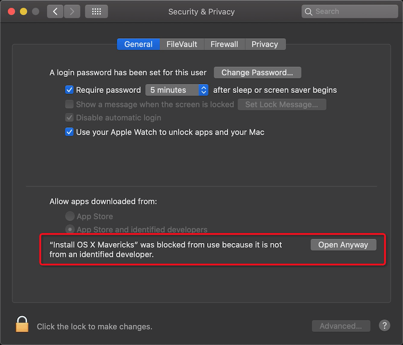
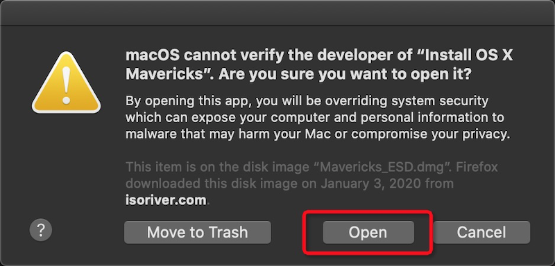
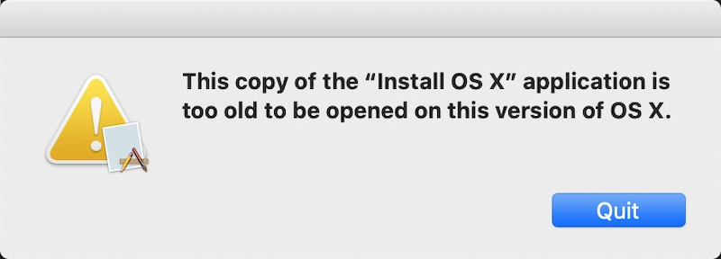
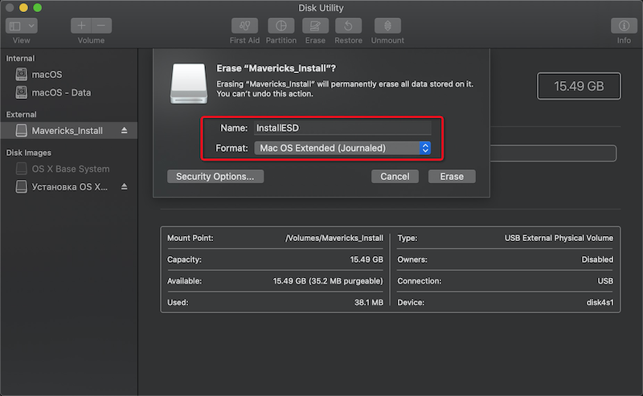
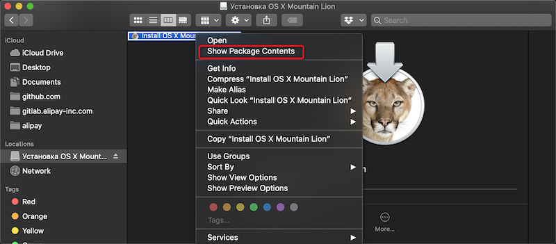
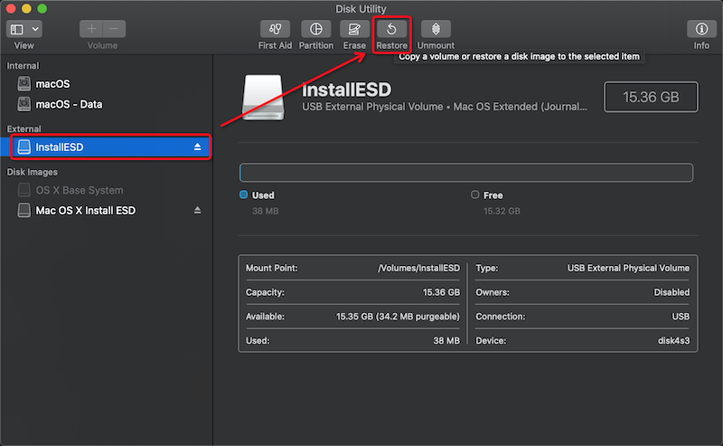
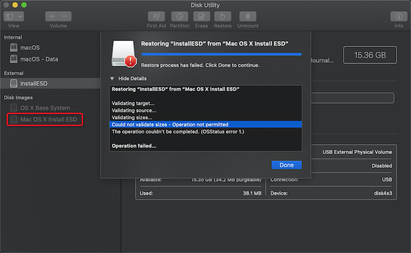
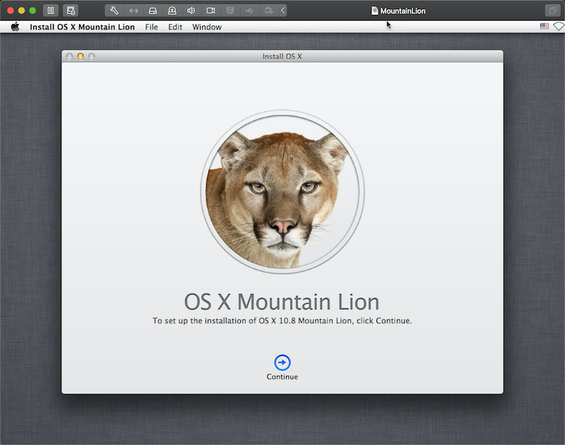
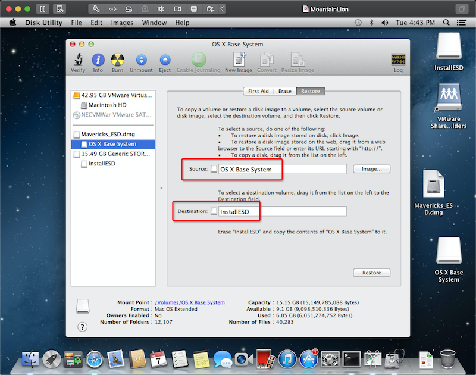

苹果公司提供了macOS的免费升级，并且每次升级都会带来全新的功能改进和bug修复。苹果的MacBook有一个特殊的recovery分区，能够通过网络自动恢复破坏的操作系统，不过，这个修复只限于最近安装的操作系统版本。也就是说，一旦操作系统升级，就如果iOS升级一样，想要回退到之前的旧版本，则非常困难。

总有一些情况下，我们需要回退到旧版本操作系统：或许因为有应用程序需要旧版本macOS支持，或者因为硬件性能有限，或者如我对旧版本的拟物化风格有一种怀旧的迷恋。

# 经验总结

实际上我折腾了好几天才把MacBook Air 2011的笔记本恢复到拟物化的Mavericks操作系统，去除掉很多弯路，摸索出的解决方法：

* 从 [Mac OS X Mountain Lion 10.8.5 Free Download](http://allmacworld.com/mac-os-x-mountain-lion-10-8-5-free-download/) 下载到 Mountain Lion 10.8.5
    * 选择Mountain Lion的原因是只有这个版本才能直接从安装包中直接复制出`InstallESD.dmg`光盘镜像；而更高的Mavericks则需要动用`createinstallmedia`镜像工具，可惜这个镜像工具必须在Mavericks操作系统中运行，并且需要从AppStore下载Installer软件包，这两个条件无法满足。
* 使用`InstallESD.dmg`光盘镜像先在VMware Fusion中安装一个Mountain Lion的虚拟机，这样就具备了最初的低版本操作系统。
* 在Mountain Lion的虚拟机中，支持使用`Disk Utility`来创建安装U盘：使用从ISORIVER下载[Mac OS X Mavericks 10.9 ISO and DMG Image Download](https://isoriver.com/mac-os-x-mavericks-10-9-iso-dmg-image/)的`Mavericks_ESD.dmg`恢复到U盘中，然后将U盘拿到物理主机MacBook Air 2011上安装。
* 后来还找到了很久以前(2017年)通过Time Machine备份的笔记本完整操作系统，[从Time Machine备份中恢复Mac数据](restore_mac_from_time_machine)的方法也可以恢复旧版本OS X，甚至可以用来创建VMware虚拟机。

----

# 不同情况下降级macOS的思路

## 运行High Sierra

如果运行High Sierra 10.12.4 或更高版本，如果你想要回到之前和你售卖的硬件时候搭载的macOS版本，则非常幸运，可以轻易做到：

* 重启Mac，同时按住 `Shift+Option+Command+R` 按键 （通常的网络修复安装是组合按键 `Option+Command+R` ，这里多加一个 `Shift` 键 ）
* 当看到macOS Utilities屏幕，直接选择 'Reinstall macOS' 并点击 'Continue' 就可以选择启动盘机型安装

## 通过Time Machine备份恢复

如果早期操作系统有Time Mahine备份，则恢复非常容易。

## 如果以上条件都不满足

如果你运行的不是 High Sierra或更高版本，也没有通过Time Machine备份过之前的低版本macOS，则降级macOS比较麻烦，需要自制一个启动安装U盘。此时你需要从AppStore中下载早期版本macOS(例如Mac OS X Snow Leopard)。

但是，如果你从来没有在App Store上下载过对应的macOS版本，就无法再次下载。此时就需要找一个曾经下载安装过对应macOS的朋友来爱在并提供你完整的安装包。

### 尝试第三方安装包(ISORIVER) - 暂未成功

ISORIVER 提供了 [Mac OS X Mavericks 10.9 ISO and DMG Image Download](https://isoriver.com/mac-os-x-mavericks-10-9-iso-dmg-image/) ，注意有两种文件:

* .dmg文件需要安装到正在运行的低版本操作系统中，或者直接挂载显示为 `/Volumes/OS X Base System/` 卷目录

```
/dev/disk2      14Gi  5.6Gi  8.5Gi    40%   52390 4294914889    0%   /Volumes/OS X Base System
```

但是这里会提示报错，并且确认按钮是 "Move to Trash"

```
“Install OS X Mavericks” cannot be opened because the developer cannot be verified.

macOS cannot verify that this app is free from malware.

This item is on the disk image "Mavericks_ESD.dmg" Firefox downloaded this disk image on January 3, 2020 from isoriver.com
```

则需要先允许第三方软件安装：





当允许安装以后，就会看到这个磁盘卷被挂载成如下（使用`df -h`可以看到):

```
/Volumes/OS X Base System/Install OS X Mavericks.app   14Gi  5.6Gi  8.5Gi    40%   52390 4294914889    0%   /private/var/folders/95/19wp7yd56_z2jknlq80t6zr00000gn/T/AppTranslocation/3B0498B3-EC3A-4E35-8D71-10A3DC775772
```

当然，由于物理主机的macOS版本较高，会提示无法安装:




注意，此时不要点击 "Quit" ，因为一旦点击该按钮，Application安装卷就被卸载了。我们就是要利用这个Application卷在VMware中安装系统，并且创建安装启动U盘。

* 另外，为了能够在物理主机(MacBook Air 2011)上安装，需要执行[创建macOS启动安装U盘](create_macos_boot_install_drive)命令如下：

```
sudo /Volumes/OS\ X\ Base\ System/Install\ OS\ X\ Mavericks.app/Contents/Resources/createinstallmedia --volume /Volumes/Mavericks_Install --applicationpath /Volumes/OS\ X\ Base\ System/Install\ OS\ X\ Mavericks.app
```

> 这里先格式化U盘（U盘文件系统命名为`Mavericks_Install`），格式化以后自动挂载成 `/Volumes/Mavericks_Install`

不过，这里报错 `/Volumes/OS X Base System/Install OS X Mavericks.app/ does not appear to be a valid OS installer application.` ，还是没有解决问题。。。

### 尝试从Mountain Lion安装


参考 [Create Bootable Copies of the OS X Mountain Lion Installer](https://www.lifewire.com/create-bootable-copies-os-x-mountain-lion-installer-2260352) 发现，早期的Mac OS X版本直接提供了一个可以刻录光盘的dmg文件，就不需要使用 `createinstallmedia` 命令了，或许可以绕过这个程序限制。

例如，比 Mavericks 版本更低的 Mountain Lion，就直接提供了 `InstallESD.dmg` ，所以我改为下载 Mountain Lion 安装软件包(Google了以下，从 [Mac OS X Mountain Lion 10.8.5 Free Download](http://allmacworld.com/mac-os-x-mountain-lion-10-8-5-free-download/) 下载)，直接从该软件包解包出光盘镜像。

> [Create Bootable Copies of the OS X Mountain Lion Installer](https://www.lifewire.com/create-bootable-copies-os-x-mountain-lion-installer-2260352): 在 `Install OS X Mountain Lion.app` 中有一个 `SharedSupport` 目录，包含了一个 `InstallESD.dmg` ，直接刻录到光盘或者制作启动U盘就能够安装系统。

* 通过Disk Utility工具格式化U盘，命名为`InstallESD`:



* 然后命令行卸载掉这个U盘挂载(假设这里自动挂载为 `/dev/disk4s1` ，也就可以看到U盘的raw设备是 `/dev/rdisk4`):

```
sudo diskutil umount /Volumes/InstallESD
```

* 下载的文件是 `Mac_OS_X_Mountain_Lion_10.8.5.dmg`
* 双击该文件打开挂载，然后右击`Install OS X Mountain Lion`，选择菜单`Show Package Contents`:



* 找到目录`Contents/SharedSupport/`下的`InstallESD.dmg`文件，将这个文件复制出来（这个文件是用来创建光盘的镜像文件)

> 参考 [How to make a bootable Lion install disc or drive](https://www.macworld.com/article/1161069/make-a-bootable-lion-installer.html) 将镜像文件写到U盘

* 使用Disk Utility工具，使用该工具的菜单命令 `File > Open Disk Image...` 并选择文件 `InstallESD.dmg` 挂载这个磁盘镜像。此时在终端执行命令 `df -h` 可以看到

```
/dev/disk5s2   4.5Gi  4.2Gi  357Mi    93%    1196 4294966083    0%   /Volumes/Mac OS X Install ESD
```

* 在Disk Utility工具中，选择之前我们格式化过的U盘，注意标记名是 `InstallESD`，然后点击 `Restore` 按钮



* 选择从 `Mac OS X Install ESD` 恢复：


这里出现报错 `Could not validate sizes - Operation not permitted`



不过，我尝试dd命令制作磁盘，但是无法启动：

```
cd /Volumes/OS\ X\ Mountain\ Lion/Install\ OS\ X\ Mountain\ Lion.app/Contents/SharedSupport/
sudo dd if=InstallESD.dmg of=/dev/rdisk4 bs=100m
```

> 我怀疑是在高版本Catalina系统中，使用这个Disk Utility不行。后来试了，若然在低版本Mountain Lion中，使用Disk Utility工具来restore磁盘是可行的。

* 虽然前面通过Disk Utility工具（我是在Catalina上运行的）恢复失败，但是从`Mac_OS_X_Mountain_Lion_10.8.5.dmg`复制出来的`InstallESD.dmg`是可以直接用VMware来安装的，所以先安装低版本Mountain Lion Mac OS X。



* 以上在VMware虚拟机中安装完成后，就可以使用Mountain Lion的低版本Disk Utility来制作启动U盘，也就可以拿到物理笔记本MacBook Air 2011上进行安装。

* 由于现在有了低版本的OS X，甚至就可以开始在虚拟机内部升级到Mavericks版本，然后再制作Mavericks的启动U盘，同样也可以拿到物理笔记本MacBook Air 2011上进行安装。

* 例如，在Mountain Lion虚拟机中，使用Disk Utility工具就可以restore方式将[Mac OS X Mavericks 10.9 ISO and DMG Image Download](https://isoriver.com/mac-os-x-mavericks-10-9-iso-dmg-image/)下载的`Mavericks_ESD.dmg`恢复到U盘中，然后将U盘拿到物理主机MacBook Air 2011上安装。`终于成功！！！`



> 真是非常不容易，这些VMware镜像需要好好保存，以便不时之需。

# Apple ID

macOS降级到低于OS X El Capitan，iOS降级到低于iOS 9，都会面临一个困难，就是系统不支持Apple ID的双重验证。

请注意，早期macOS和iOS都不支持两步验证的方式，会导致无法登陆Apple账号。参考[从两步验证切换至双重认证](https://support.apple.com/zh-cn/HT207198)中的有关关闭两步验证的方法，先关闭两步验证才能继续安装。但是，实际上苹果没有提供安全降级方法，即一旦开启了双重认证就无法关闭，则需要重新申请一个账号，并且在创建账号时候一定需要注意：

* 使用一台高版本macOS电脑创建新账号，一定要选择美国区创建账号（中国区创建账号默认就启用了双重认证并且无法选择关闭），见下文。
* 创建完美区账号以后，一定要登陆一次App Store，此时会提示review账号信息，则按照下文方式填写美国地址信息，完成后才能在App Store上购买和下载软件。

> 提供的dmg文件是需要安装在低版本Mac OS X上，然后才能制作安装U盘，或者通过VMware安装虚拟机。问题难度在于，难以找到合适的硬件设备，先安装一个低版本的Mac OS X。

由于我的MacBook Air 11 2011版本，随机是的Lion版本OS X。目前iOS 9和OS X El Capitan都开始支持[Apple ID 的双重认证](https://support.apple.com/zh-cn/HT204915)，并且账号双重验证一旦开启将[无法关闭双重验证](https://discussionschinese.apple.com/thread/250536330)。所以，如果你都账号已经启用了双重验证，则旧设备旧无法使用该账号，必须重新注册一个新的Apple ID。

然后通过[网络recovery安装macOS](reinstall_macos_from_recovery)方法重新安装最初的Lion版本 - 遗憾的是，实践下来发现App Store已经关闭了Lion版本的下载，所以无法恢复安装MacBook Air 2011版本随机的Lion系统。

> 这是一个悖论：苹果不允许你安装比自己物理主机更低版本操作系统，VMware也不能解决这个问题。但是，如果有人的物理主机恰好是低版本操作系统，并且曾经在App Store上选择安装过各个比本机更高的版本，就能够从App Store上下载对应版本的Installer，也就能够升级并安装对应的版本。

[How to Install Mac OS on Windows PC using Virtual Machine](https://isoriver.com/how-to-install-mac-os-on-windows-pc-using-virtual-machine/)提供了[Mac OS Mojave 10.14 ISO file](https://isoriver.com/macos-mojave-10-14-download/) or [Mac OS Mojave 10.14 VMDK Image](https://drive.google.com/uc?id=1wqCHlEyR3V8aIF4i0d8Ut_2vj7VM7s4q&export=download)。由于我没有低版本的macOS，所以只能下载vmdk，在VMware中运行，然后创建安装U盘，这样才能在自己的笔记本上安装系统。

## 美区Apple ID申请

应用软件最丰富的是美区，并且美区账号的iCloud数据不会保存在国内的云上贵州。申请美区账号方法，请参考 [如何申请美区苹果App Store账户？](https://www.zhihu.com/question/26458172)，其中特别推荐 "syl小虫" 的答案（提供了详细的自助找到美国地址的方法）。

* [部署OpenConnect VPN](../../security/vpn/openconnect/deploy_openconnect_vpn_server_ocserv_with_certificate)翻墙，这个目的是为了更新账号时采用美国IP地址。如果你不方便自己部署VPN，也可以采用比较简单的[ssh端口转发](../../service/ssh/ssh_port_forwarding)方法，使得浏览器访问苹果服务器验证显示为美国IP地址。当然，如果你不是技术工作者，或者对技术细节不感兴趣，则可以购买一个VPN账号来实现这个功能。
* 访问 [Google 地图](https://www.google.com/maps) ，通过卫星地图随便找一个房子，就能够看到对应地址，以及邮编。
* 从 [美国国际区号](https://cn.mip.chahaoba.com/美国) 可以查到地址对应的区号，至于电话号码，则为 xxx-xxxx 大概编写一个就是了。

## 应用软件购买

申请到美区账号以后，实际上由于没有绑定信用卡，是不能直接购买收费软件的。不过，苹果支持Gift Card，可以直接在美亚上购买充值，就可以购买需要的软件的。

> 很遗憾，实际上由于苹果全面转向64位系统，并且平面化风格以后，大多数iOS软件已经无法在旧版本6.1.x上运行了。需要采用第三方平台通过越狱安装。不过，如果有一个古老的[Mac OS X Mavericks和iOS 6组合(体验最后的拟物化苹果生态)](mac_os_x_mavericks_and_ios_6)也是一个神奇的体验。

# 参考

* [How to downgrade to an earlier version of macOS](https://www.chriswrites.com/how-to-downgrade-to-an-earlier-version-of-macos/)