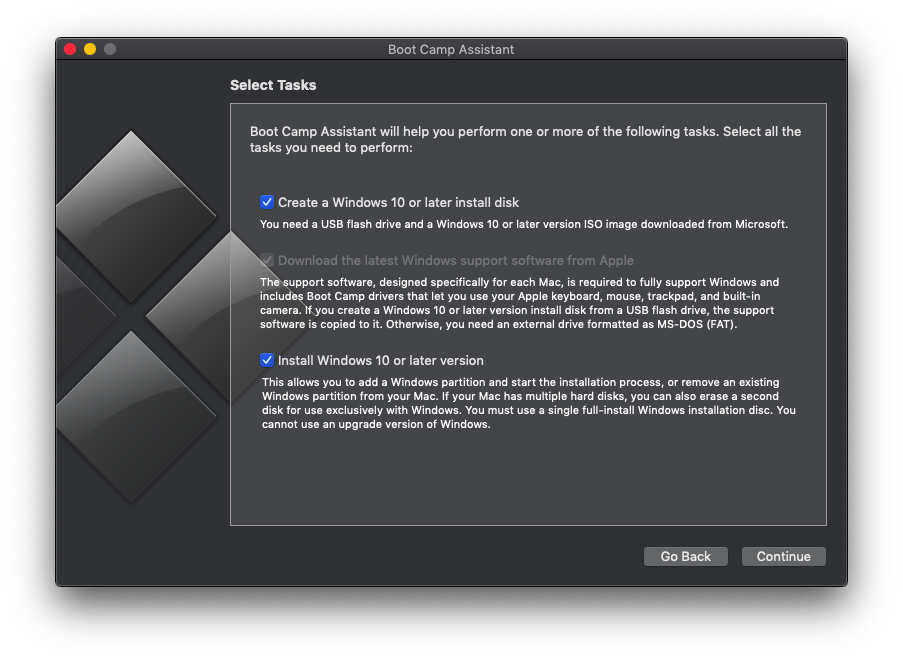
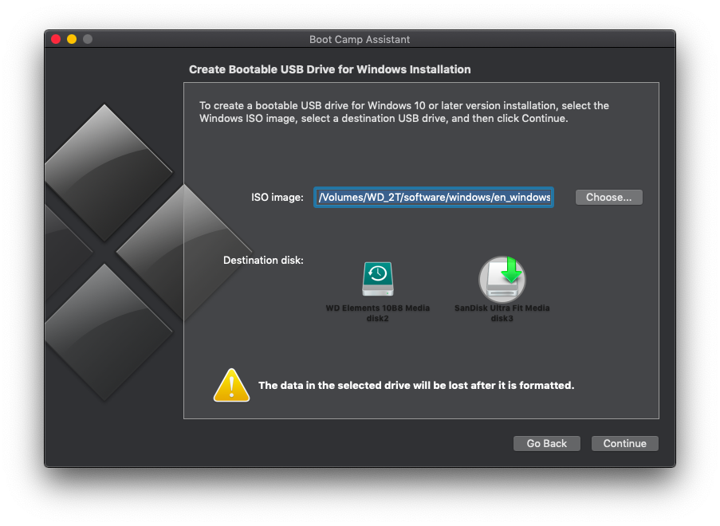

macOS非常适合工作学习，然而有时候也需要使用Windows软件。通常我采用[Vmware Fusion](../../virtual/vmware/timekeeping_in_vmware)来运行Windows软件。但是，如果经常使用Windows系统，并且希望硬件性能不要因为虚拟化而损失，则可以考虑在Mac硬件上直接安装Windows操作系统。macOS提供了Boot Camp Assistant来帮助我们以双启动方式切换macOS和Windows。由于是Apple官方支持，所以相对于[在Mac上双启动方式安装Linux](dual_boot_linux_on_mac)要更为简单易用。

# 使用Boot Camp的要求

* 注意Mac的硬件有一定要求，通常需要2012年之后的Mac硬件，具体请参考官方[Install Windows 10 on your Mac with Boot Camp Assistant](https://support.apple.com/en-us/HT201468)
* macOS需要升级到最新版本
* 需要至少64G空间用于创建Boot Camp分区，如果使用Windows自动更新，则至少128G。
* 注意，Windows 10必须是64位版本
* 参考 [在 macOS Mojave 上通过 Boot Camp 安装最新的 Windows 10](https://imtx.me/archives/2725.html)：最新的Windows ISO镜像解包文件有单个文件超过4GB的，超过Boot Camp安装Windows时创建的FAT32分区所支持的最大4GB文件限制，会导致安装失败。需要使用 [Boot Camp ISO Converter](https://twocanoes-software-updates.s3.amazonaws.com/Boot%20Camp%20ISO%20Converter1_6.dmg) 处理。

# 安装Windows

* 启动Boot Camp Assistant创建一个BOOTCAMP分区

注意，一旦创建BOOTCAMP分区 ，该分区就不能修改大小。

注意，需要准备好Windows的ISO文件，以及一个空白的U盘，Boot Camp Assistant会制作一个启动安装Windows的U盘。

* 按照导引选择Windows安装镜像文件以及创建的目标U盘，目标U盘上所有数据都将抹除：

# 参考

* [Install Windows 10 on your Mac with Boot Camp Assistant](https://support.apple.com/en-us/HT201468)
* [在 macOS Mojave 上通过 Boot Camp 安装最新的 Windows 10](https://imtx.me/archives/2725.html) - 使用Boot Camp安装的Windows系统可以使用的最新的TouchBar硬件，另外介绍了处理超大Windows镜像文件的技巧 Boot Camp ISO Converter