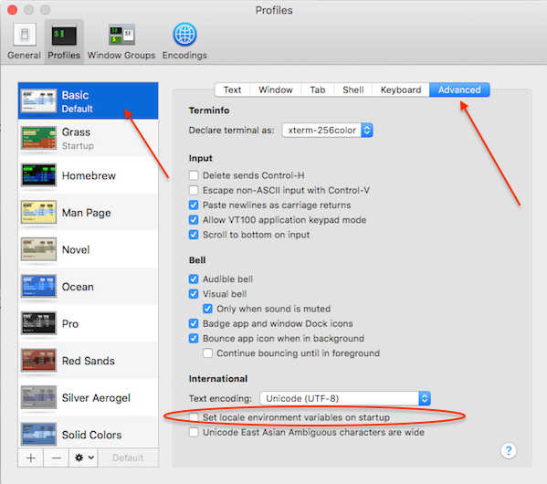

在Mac OS X系统上通过ssh登陆Linux服务器，终端提示

```
-bash: warning: setlocale: LC_CTYPE: cannot change locale (UTF-8): No such file or directory
```

以上告警提示和OpenSSH服务器以及OS X ssh终端软件有关。可以通过不同方式修复。

# `LC_*`环境变量

在远程服务器上使用以下命令可以显示Glibc所有的locales支持：

```
locale -a
```

在本地系统（OSX/Unix/Linux桌面）执行以下命令显示设置：

```
printenv
echo "$LC_CTYPE"
```

此时显示输出

```
UTF-8
```

以上在本地macOS主机上显示的国家和语言名字，就是被`locale`使用的字符集。所以本地`ssh`就会发送`LC_*`环境变量到远程sshd服务器。也就是说，SSH尝试设置每个在本地macOS所设置的`LC_*`环境变量给远程服务器。而Linux服务器上没有对应的`LC_CTYPE=UTF-8`的配置。

# 修复`LC_CTYPE`

## 方法1:如果在macOS中使用自己的Terminal应用

例如，[iTerm2](https://www.iterm2.com/) 可以设置**取消**`Set locale environment variables on startup`



## 方法2:避免macOS/Linux/Unix桌面的OpenSSH客户端发送`LC_*`变量

* 编辑`/etc/ssh/ssh_config` 或者 `/etc/ssh_config`

删除以下行或者注释掉以下行：

```bash
#SendEnv LANG LC_*
```

## 方法3:在远程服务器上安装需要的locale

也可以在远程服务器上安装对应的locale

```
localedef -i en_US -f UTF-8 en_US.UTF-8
```

# 参考

* [OS X Terminal: -bash: warning: setlocale: LC_CTYPE: cannot change locale (UTF-8): No such file or directory Fix](https://www.cyberciti.biz/faq/os-x-terminal-bash-warning-setlocale-lc_ctype-cannot-change-locale/)