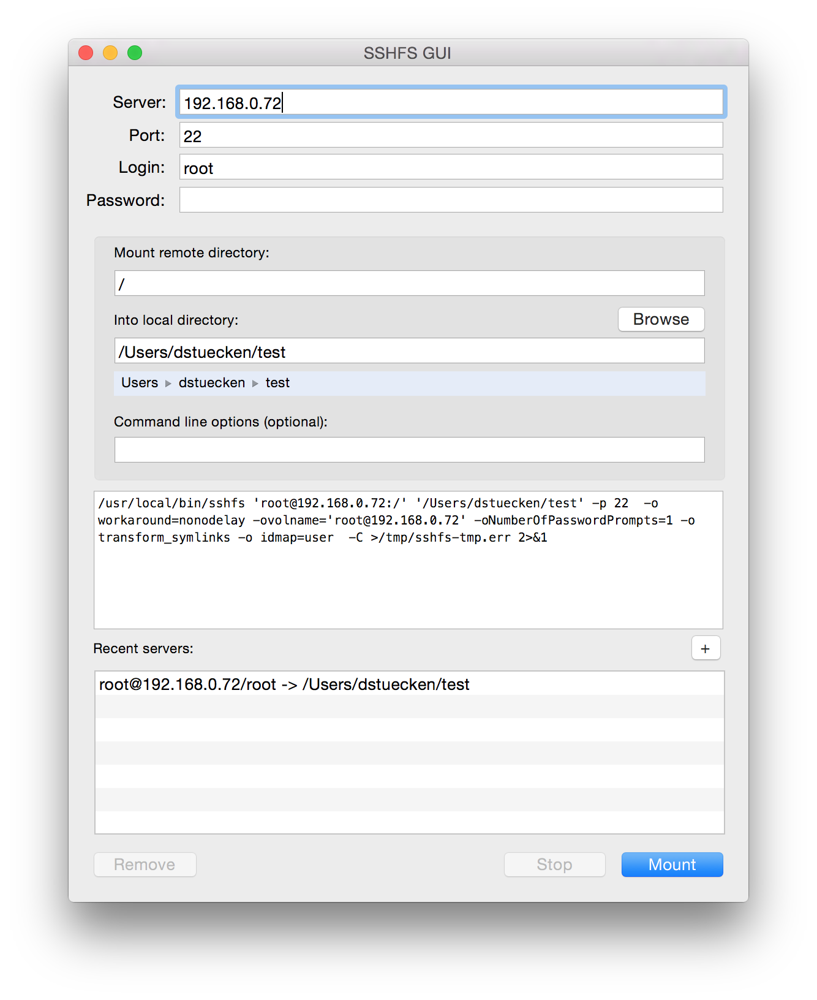

作为Linux开发者，大多数后台服务程序、脚本开发都需要远程ssh登录到服务器上完成。然而，在Linux终端实现一个非常完善的IDE开发环境，学习曲线非常陡峭。

有没有结合Mac平台优秀的开发工具 - Apple Xcode / Microsoft Code / JetBrains IDE 实现远程开发Linux服务器上软件的方法呢？

答案是：SSHFS

* 从 [FUSE for macOS](https://osxfuse.github.io/) 下载安装 FUSE for macOS 3.6.0
* 从 [SSHFS](https://github.com/osxfuse/sshfs) 下载安装 SSHFS 2.5.0
* 从 [SSHFS GUI Wrapper for Mac OS X](https://github.com/dstuecken/sshfs-gui) 下载 sshfs-gui 1.3.1

依次安装完成后，直接使用 SSHFS GUI图形界面就可以将远程ssh登录服务器上的目录挂载到本地目录上。

完成后可以在Mac OS X Finder文件管理器中浏览文件，复制文件。同时，本地的开发工具IDE可以将远程服务器上目录当成本地目录，也就能够实现程序文件编辑，git提交管理等操作。

> 由于跨平台，所以暂时没有找到在Mac平台交叉编译其他平台二进制程序的方法。不过，对于gcc，是支持跨平台编译，理论上LLVC等编译器应该也能够完成。

SSHFS不仅提供了远程开发Linux服务器上脚本、Java、C等语言的方法，甚至可以用来开发Swift for Linux。