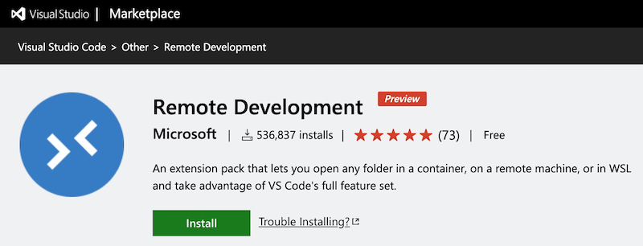

VS Code Remote Development允许使用container容器，远程服务器或者Windows Subsystem for Linux (WSL)作为全功能开发环境：

* 可以在和部署环境完全相同的操作系统中开发，或者使用更为强劲或特殊的硬件
* 开发环境沙箱化可以避免影响本地主机配置
* 更容易让那个新的开发者起步和保持一致的环境
* 使用的工具或者云心管ing不再受限雨本地操作系统，或者能够管理运行环境的多个版本
* 可以在云计算环境中开发Linux部署应用
* 可以在不同主机或环境下访问相同的开发环境
* 随时随地可以在客户站点或者云计算环境中调试运行程序

在你的本地不需要任何源代码存储，在远程开发扩展包中的每个扩展都能够运行命令以及在容器或远程主机中直接使用，就好像本地运行一样。


# 远程开发扩展包

[Remote Development extension pack](https://aka.ms/vscode-remote/download/extension)包括3个扩展:

* [远程SSH](https://code.visualstudio.com/docs/remote/ssh) 可以在远程主机或者VM上使用SSH连接任何共享目录

# 安装

* 首先访问 [Remote Development](https://marketplace.visualstudio.com/items?itemName=ms-vscode-remote.vscode-remote-extensionpack) 扩展，并点击安装。这个扩展安装包含了3个子扩展，分别支持SSH,container和WSL。



> 本地需要具备SSH客户端(需要兼容OpenSSH)

# 设置SSH主机

* 建议使用密钥认证，不过VSC也支持密码认证。首先验证是否可以登陆主机：

```
ssh user@hostname
```

对于Windows主机的ssh登陆需要结合域名 `ssh user@domain@hostname`

* 在VSC中，在命令行面板(按 `F1`)，然后选择 `Remote-SSH: Connect to Host...` ，输入远程登陆的账号名和主机名，类似 `username@hostname` 

* 如果你经常使用远程访问ssh服务器，可以在 `~/.ssh/config` 配置中加上自己的服务器配置，例如 `my_studio` :

```bash
Host my_studio
    HostName 192.168.1.11
    User huatai
```

则在VSC中在命令行面板(按 `F1`)，选择 `Remote-SSH: Connect to Host...`，就会看到下拉菜单中包含了自己配置的 `my_studio` 选项，也就不需要手工输入地址，直接选择就可以连接到 `my_studio` 服务器。

初始化过程，会在远程服务器上下载安装VSC Server:

* 然后会提示你打开远程服务器目录，实际上使用体验和本地目录无异，只是速度受到网络影响。打开远程目录也是使用 `File > Open...` 或 `File > Open Workspace...`


* 开发完成以后，请使用 `File > Close Remote Connection` 关闭连接。当然，退出VSC也能关闭连接

# 报错排查

我设置了ssh密钥登陆，并且能够正常登陆服务器，但是使用VSC远程访问连接报错

```
Failed to connect to the remote extension host server (Error: Connection error: Unauthorized client refused.)
```

非常奇怪，同样的配置，访问有的服务器是正常工作的，但是也有服务器不能正常。在微软的 [vscode-remote-release > Failed to connect to the remote extension host server (Error: Connection error: Unauthorized client refused.) #103](https://github.com/microsoft/vscode-remote-release/issues/103) 有大量相关讨论

# 参考

* [VS Code Remote Development](https://code.visualstudio.com/docs/remote/remote-overview)
* [Remote Development tutorials](https://code.visualstudio.com/docs/remote/remote-tutorials)