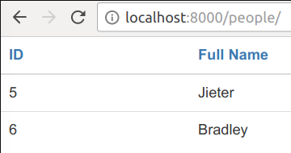

作为不擅长前端的Django初学者，如何能够美观展示HTML table是一个头疼的事。

虽然django很容易实现查询表格并展示，但是简陋的table显得很不专业。

django-tables2 是一个创建HTML tables的app，简化了对样式等技术的开发要求。

> 本文是官方手册的摘要，原文非常简练，以快速完成项目工作为目标。

* 安装`django-tables2`

```
pip install django-tables2
```

# 在app中使用`django-tables2`

* 创建Django app (这里命名是`tutorial`)

```
python manage.py startapp tutorial
```

* 在项目的`settings.py`的`INSTALLED_APPS`中添加`django_tables2`和`turorial`

* 在`tutorial/models.py`中添加model

```python
# tutorial/models.py
class Person(models.Model):
    name = models.CharField(max_length=100, verbose_name='full name')
```

* 使用以下命令创建数据库表

```
python manage.py makemigrations tutorial
python manage.py migrate tutorial
```

* 通过django shell添加数据库表内容

```
$ python manage.py shell
>>> from tutorial.models import Person
>>> Person.objects.bulk_create([Person(name='Jieter'), Person(name='Bradley')])
[<Person: Person object>, <Person: Person object>]
```

* 处理`Person`查询集的视图

```python
# tutorial/views.py
from django.shortcuts import render
from .models import Person

def people(request):
    return render(request, 'tutorial/people.html', {'people': Person.objects.all()})
```

* 创建模板

```html
{# tutorial/templates/tutorial/people.html #}

<!doctype html>
<html>
    <head>
        <title>List of persons</title>
    </head>
    <body>
        
    </body>
</html>
```

> 以上完成后可以看到一个简单的页面 http://localhost:8000/people/

下面将开始真正的Table定制

* 为了能够定义一个定制的查询页面，首先定义一个`Table`类：

```python
# tutorial/tables.py
import django_tables2 as tables
from .models import Person

class PersonTable(tables.Table):
    class Meta:
        model = Person
        template = 'django_tables2/bootstrap.html'
```

* 然后配置view中的table

```python
# tutorial/views.py
from django.shortcuts import render
from django_tables2 import RequestConfig
from .models import Person
from .tables import PersonTable

def people(request):
    table = PersonTable(Person.objects.all())
    RequestConfig(request).configure(table)
    return render(request, 'people.html', {'table': table})
```

> 使用`RequestConfig`自动从`reuqest.GET`取出值并相应过更新表格。这样数据就会整齐和页面化。

* 然后将查询集(queryset)传递给``而不是传递给table instance：

```html
{# tutorial/templates/tutorial/people.html #}

<!doctype html>
<html>
    <head>
        <title>List of persons</title>
        <link rel="stylesheet" href="https://maxcdn.bootstrapcdn.com/bootstrap/3.3.7/css/bootstrap.min.css" />
    </head>
    <body>
        
    </body>
</html>
```

现在就可以看到一个bootstrap3 stylesheet的表单了：



# 参考

* [django-tables2 Doc：Tutorial](http://django-tables2.readthedocs.io/en/latest/pages/tutorial.html)