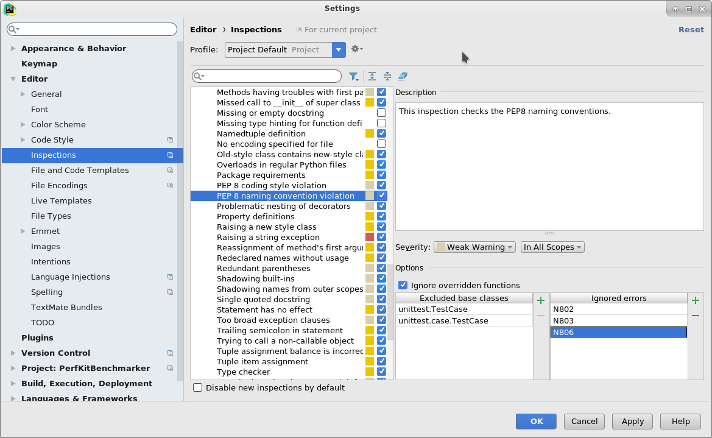

# 思考

当开始一个Python项目，我的意思是不仅仅是快速脚本的拼凑，而是作为一个产品化的程序，如何组织代码和文档，是需要精心考虑的。参考成熟的开源项目编程风范，使自己的程序能够不断迭代优化，是需要从开始就做好规划的。

# 工具和概念

以下是开发Python项目的工具和概念，可以帮助我们更好组织项目，编写更清晰的代码：

* 项目层次（目录结构）
* `setuptools`和`setup.py`文件
* [git](http://www.git-scm.com/)版本控制
* 使用[GitHub](http://www.github.com/)管理项目
    * GigHub的"Issues"用于以下功能：
        * bug跟踪
        * 功能需求
        * 未来计划
        * 发布/版本管理
* [git-flow](http://nvie.com/posts/a-successful-git-branching-model/)实现git工作流
* [py.test](http://www.pytest.org/)实现单元测试
* [tox](http://tox.readthedocs.org/en/latest/)实现测试标准化
* [Sphinx](http://www.sphinx-doc.org/)用于自动生成HTML文档
* [TravisCI](https://travis-ci.org/)用于持续测试集成
* [ReadTheDocs](https://readthedocs.org/)用于持续文档集成
* [Cookiecutter](https://github.com/audreyr/cookiecutter-pypackage)用于将上述步骤自动化以启动下一个项目

# 项目层次（目录结构）

当设置一个项目，`layout`(或称为目录结构)是正确开始的重要步骤。一个恰当的项目层次意味着潜在的代码贡献者不必浪费时间找寻代码片段，凭直觉就能找到文件。

大多数项目都有一些顶层文件（类似`setup.py`, `README.md`, `requirements.txt`等），然后有3个目录是每个项目都具备的：

* `docs`目录包含项目文档
* 一个和项目名称相同的目录存储实际的Python包
* 一个`test`目录位于2个位置：
    * 在包目录下的`test`目录包含测试代码和资源
    * 以及一个顶层的独立目录

以下是一个简单的`sandman`项目（注：这里采用了[Open Sourcing a Python Project the Right Way](https://jeffknupp.com/blog/2013/08/16/open-sourcing-a-python-project-the-right-way/)文档中案例）

```
$ pwd
~/code/sandman
$ tree
.
|- LICENSE
|- README.md
|- TODO.md
|- docs
|   |-- conf.py
|   |-- generated
|   |-- index.rst
|   |-- installation.rst
|   |-- modules.rst
|   |-- quickstart.rst
|   |-- sandman.rst
|- requirements.txt
|- sandman
|   |-- __init__.py
|   |-- exception.py
|   |-- model.py
|   |-- sandman.py
|   |-- test
|       |-- models.py
|       |-- test_sandman.py
|- setup.py
```

上述，有一个`docs`目录（其中`generated`目录是一个空目录，sphinx将生成的文档存放在这个目录中），有一个`sandman`目录，以及在`sandman`目录下的`test`子目录。

# `setuptools`和`setup.py`文件

`setup.py`文件类似于其他通过`diskutils`包来使用其他包用于安装Python包。它是任何项目一个非常重要的文件，因为它包含了在PyPI中使用的版本信息，软件包环境需求，项目描述，以及你的名字和联系信息等等。这个文件使得软件包能够以一种程序化的方法被搜索和安装，提供了元数据和介绍工具。

`setuptools`包（实际上是`diskutils`的一个增强）将构建和分发Python软件包进行了简化。一个Python软件包可以通过`setuptools`打包并且和`diskutils`打包几乎完全一样。所以没有理由不使用`setuptools`。

`setup.py`位于项目的根目录。最重要的`setup.py`部分称为`setuptools.setup`，也就是包含了包的所有元信息部分。

以下是完整[sandman](https://github.com/jeffknupp/sandman)项目的`setup.py`

```
from __future__ import print_function
from setuptools import setup, find_packages
from setuptools.command.test import test as TestCommand
import io
import codecs
import os
import sys

import sandman

here = os.path.abspath(os.path.dirname(__file__))

def read(*filenames, **kwargs):
    encoding = kwargs.get('encoding', 'utf-8')
    sep = kwargs.get('sep', '\n')
    buf = []
    for filename in filenames:
        with io.open(filename, encoding=encoding) as f:
            buf.append(f.read())
    return sep.join(buf)

long_description = read('README.txt', 'CHANGES.txt')

class PyTest(TestCommand):
    def finalize_options(self):
        TestCommand.finalize_options(self)
        self.test_args = []
        self.test_suite = True

    def run_tests(self):
        import pytest
        errcode = pytest.main(self.test_args)
        sys.exit(errcode)

setup(
    name='sandman',
    version=sandman.__version__,
    url='http://github.com/jeffknupp/sandman/',
    license='Apache Software License',
    author='Jeff Knupp',
    tests_require=['pytest'],
    install_requires=['Flask>=0.10.1',
                    'Flask-SQLAlchemy>=1.0',
                    'SQLAlchemy==0.8.2',
                    ],
    cmdclass={'test': PyTest},
    author_email='jeff@jeffknupp.com',
    description='Automated REST APIs for existing database-driven systems',
    long_description=long_description,
    packages=['sandman'],
    include_package_data=True,
    platforms='any',
    test_suite='sandman.test.test_sandman',
    classifiers = [
        'Programming Language :: Python',
        'Development Status :: 4 - Beta',
        'Natural Language :: English',
        'Environment :: Web Environment',
        'Intended Audience :: Developers',
        'License :: OSI Approved :: Apache Software License',
        'Operating System :: OS Independent',
        'Topic :: Software Development :: Libraries :: Python Modules',
        'Topic :: Software Development :: Libraries :: Application Frameworks',
        'Topic :: Internet :: WWW/HTTP :: Dynamic Content',
        ],
    extras_require={
        'testing': ['pytest'],
    }
)
```

## 快速脚手架工具`cookiecutter`

> [cookiecutter](https://www.pydanny.com/cookie-project-templates-made-easy.html) 提供了一个快速创建模版的工具

```
pip install cookiecutter
```

然后执行

```
cookiecutter https://github.com/audreyr/cookiecutter-pypackage.git
```

会提示一些问题，然后为你创建好目录结构及相应文件

`README.md`文件可以通过[pandoc](http://johnmacfarlane.net/pandoc/)来自动生成`README.rst`是正确开始的重要步骤。一个恰当的项目层次意味着潜在的代码贡献者不必浪费时间找寻代码片段，凭直觉就能找到文件。

详细使用`setuptools`的方法参考[Distributing Python Modules](https://docs.python.org/2/distributing/index.html#distributing-index)

```
python -m pip install setuptools wheel twine
```

# 源代码版本管理 - GitHub

# 使用git-flow来管理git工作流

建议使用 [git-flow](http://nvie.com/posts/a-successful-git-branching-model/) 分支模式。

* `develop`是最主要的工作分之，也是用于部署下一个发行版的分支代码。
* `feature`分支是相当于功能分之并且还没有部署的版本
* 通过创建`release`分支来更新`master`主干

参考[这篇](http://nvie.com/posts/a-successful-git-branching-model/)来安装`git-flow`

在Mac平台有多种方法安装，我采用如下方法

```
curl -L -O https://raw.github.com/nvie/gitflow/develop/contrib/gitflow-installer.sh
sudo bash gitflow-installer.sh
```

然后执行以下命令将现有的项目迁移

```
git flow init
```

使用默认参数，完成后会自动创建`develop`和`master`分支。

大多数工作都是在`develop`分支，包含了所有完成的功能和bug fix用于发布；nightly builds或持续集成服务器将标记为`develop`。

要开始一个新功能，使用

```
git flow feature start <feature name>
```

此时就会创建一个新的分支: `feature/<feature name>`。此时commit就会在这个分支，当功能就绪准备发布产品，就会合并到develop，则使用如下命令

```
git flow feature finish <feature name>
```

代码合并到`develop`分支并且会删除掉`feature/<feature name>`分支。

当准备发布产品时候，就从`develop`分支创建`release`分支。使用如下命令：

```
git flow release start <release number>
```

所有的完成并且准备发布功能的必须位于`develop`，这样才能`feature finish`。当创建了release分支，则可以发布代码。一些在release之后的小的bug fix则直接在`release/<release number>`分支。如果已经解决并且没有bug则使用如下命令：

```
git flow release finish <release number>
```

这就会合并`releae/<release number>`回到`master`和`develop`分支。

`hotfix`类似从`master`分离出的`feature`：如果你已经关闭了`release`分支但是意识到有必不可少的修改需要发布，则从`master`分离出`hotfix`分支（在`git flow release finish <release number>`之后）类似：

```
git flow hotfix start <release number>
```

然后在修改完成后，执行

```
git flow hotfix finish <release number>
```

# `virtualenv`和`virtualenvwrapper`

如果在一个服务器上有多个Python项目，每个项目有不同的依赖，可以使用`virtualenv`来创建虚拟机的Python安装，这样`site-packages`,`distribute`和`pip`将按照这个方式独立。`pip install`将软件包安装到`virtualeve`而不是系统的Python安装。在不同的`virtualenv`之间切换是非常简单的一条命令。

`virtualenvwrapper`是一个单独的工具，用于创建和管理`virtualenv`:

```
pip install `virtualenvwrapper`
```

安装完成后，需要将路径添加到环境中

```
echo "source /usr/local/bin/virtualenvwrapper.sh" >> ~/.bashrc
```

创建虚拟化环境

```
mkvirtualenv ossproject
```

在虚拟环境中，很容易生成`requirements.txt`，因为`pip`可以通过`requirements.txt`和`-r`参数安装任何项目依赖。要创建这个文件，执行以下命令

```
(ossproject)$ pip freeze > requirements.txt
```

# 测试`py.test`

Python标准库`unittest`包：[nose](http://www.nosetest.org/)和[py.test](http://www.pytest.org/)。两者都扩展了`unittest`来使得容易添加附加功能。

测试设置：

在`test`目录下，创建一个名为`test_<project_name>.py`文件，`py.test`的测试目录机制就会讲任何`test_`开头的文件作为一个测试文件（除非告诉它不怎么做）。

测试覆盖：

结合`py.test`，我们使用Ned Batchelder的[coverage](http://nedbatchelder.com/code/coverage/)工具。要执行这个，线执行`pip install pytest-cov`。

# 使用Tox完成标准化测试

Python的一个项目维护问题是`兼容性`。如果目标是支持Python 2.x和Python 3.x，则需要确保代码可以在指定平台正常工作。[tox](http://tox.readthedocs.org/en/latest/)提供了"Pythong标准化测试"：它能够创建一个完整的沙盒环境并安装你的软件包及其环境来进行测试。

`tox`是通过`.ini`文件：`tox.ini`来配置的，非常容易设置，以下是一个最小化的`tox.ini`：

```
# content of: tox.ini , put in same dir as setup.py
[tox]
envlist = py26,py27
[testenv]
deps=pytest       # install pytest in the venvs
commands=py.test  # or 'nosetests' or ...
```

通过在`envlist`中设置`py26`和`py27`，`tox`就可以知道需要针对哪种环境测试。并且`tox`默认就支持多种环境，例如`jython`和`pypy`。

`dpes`是软件包的依赖，甚至可以告诉`tox`从一个替代的PyPI URL安装所有或部分依赖。最后，执行所有环境的检查

```
tox
```

* `setuptools`集成

`tox`可以集成到`setuptools`这样`python setup.py test`就可以运行`tox`测试。以下代码片段是从`tox`文档中摘录加入到`setup.py`文件：

```
from setuptools.command.test import test as TestCommand
import sys

class Tox(TestCommand):
    def finalize_options(self):
        TestCommand.finalize_options(self)
        self.test_args = []
        self.test_suite = True
    def run_tests(self):
        #import here, cause outside the eggs aren't loaded
        import tox
        errcode = tox.cmdline(self.test_args)
        sys.exit(errcode)

setup(
    #...,
    tests_require=['tox'],
    cmdclass = {'test': Tox},
    )
```

# 使用Sphinx撰写文档

[Sphinx](http://www.sphinx-doc.org/)是从[pocoo](http://www.pocoo.org/)演化出来的工具，用于生成Python文档，从代码尽可能方便地自动生成HTML文档。

sphinx有一个类似`javadoc`的扩展，称为`autodoc`，可以从代码文档字符串中提取出reStructured文本。要能够充分使用Sphinx和`autodoc`，需要格式化代码文档字符串以便使用Sphinx的Python directives。

以下是一个模块功能使用了

```
def _validate(cls, method, resource=None):
"""Return ``True`` if the the given *cls* supports the HTTP *method* found
on the incoming HTTP request.

:param cls: class associated with the request's endpoint
:type cls: :class:`sandman.model.Model` instance
:param string method: HTTP method of incoming request
:param resource: *cls* instance associated with the request
:type resource: :class:`sandman.model.Model` or None
:rtype: bool

"""
if not method in cls.__methods__:
    return False

class_validator_name = 'validate_' + method

if hasattr(cls, class_validator_name):
    class_validator = getattr(cls, class_validator_name)
    return class_validator(resource)

return True
```

然后在项目根目录下执行

```
sphinx-apidoc -F -o docs <package name>
```

则会在`docs`目录下创建Sphinx的文档，并创建构建html输出的脚本。然后进入`docs`目录，创建输出

```
cd docs
make html
```

生成的文档输出到`docs`目录下的`_build/html/`子目录中

# PEP 8

Jetbrains 默认支持PEP 8代码风格检查

## 缩进不符合规范

```
PEP 8: indentation is not a multiple of four
```

解决的方法有两种：

* 重新格式化代码(推荐)：选择`Code`菜单，然后选择`Reformat Code`就能够执行代码重新格式化，以符合标准。如果要修改通用的代码风格，例如每行缩进的空格数量，可以使用`Code Style -> Python`，可以调整缩进成词，空格，回行，空白行。在设置中可以搜索`pep`来关闭PEP8特定的设置。 - 参考 [How to get rid of all the underlines that indicates a typo or too many spaces?](https://intellij-support.jetbrains.com/hc/en-us/community/posts/206602045-How-to-get-rid-of-all-the-underlines-that-indicates-a-typo-or-too-many-spaces-)
* 忽略(不推荐)：在任何提示信息的高亮代码行按下`Alt-Enter`，然后选择`Ignore errors like this`，这样就会在`pycodestyle.py`中加入W191到黑名单，忽略所有PEP8警告。 - 参考 [get rid of PEP8 indentation warning in docstrings](https://intellij-support.jetbrains.com/hc/en-us/community/posts/115000005224-get-rid-of-PEP8-indentation-warning-in-docstrings)

## 函数名不符合规范

> 参考[What is the naming convention in Python for variable and function names?](https://stackoverflow.com/questions/159720/what-is-the-naming-convention-in-python-for-variable-and-function-names)

Python PEP8对于函数名和变量要求全部采用小写字母，单词间分隔采用下划线`_`；只有在遗留代码中已经存在混合大小写命名情况才使用mixedCase。

要忽略已经存在的这种变量或函数大小写，可以采用类似前述处理缩进忽略方法，按下`Alt-Enter`然后选择`Ignore errors like this`。

另一种方法参考 [function name should be lowercase](http://blog.csdn.net/u012706792/article/details/71787492)，使用菜单`File –>Settings–>Editor–>Inspections–>Python–>PEP 8 naming convention violation`



# 参考

* [Open Sourcing a Python Project the Right Way](https://jeffknupp.com/blog/2013/08/16/open-sourcing-a-python-project-the-right-way/)
* [正确地组织python项目的结构](http://www.cnblogs.com/harrychinese/p/python_project_structure.html)
* [Structuring Your Project](http://docs.python-guide.org/en/latest/writing/structure/)