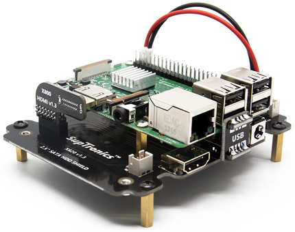

默认情况下树莓派Raspberry Pi是从SD卡启动系统的，但是SD卡存储容量有限，如果能够转换成磁盘启动（SSD/HDD）则可以实现一个海量的存储系统。

树莓派没有内建的SATA接口，如果要接磁盘设备，采用的是USB接口连接的磁盘设备。

> 最初我以为树莓派可以通过扩展卡来支持SATA磁盘，后来参考[Raspberry Pi: Adding an SSD drive to the Pi-Desktop kit](http://www.zdnet.com/article/raspberry-pi-adding-an-ssd-drive-to-the-pi-desktop-kit/)，发现类似的解决复方氨是通过一种USB连接卡转换成 mSATA 或者 SATA接口，这样就类似于常用的USB接口移动硬盘连接，但使用转接卡可以获得紧凑的转接。
>
> [mSATA](https://baike.baidu.com/item/mSATA)是SATA技术整合在小尺寸装置的接口控制器规范。目前笔记本电脑开始使用这种接口用于固态硬盘。
>
> 

当前SSD固态硬盘价格还远高于HDD磁盘，在组建大容量存储用于存储离线数据或非高性能访问要求数据的，可以考虑采用低廉的HDD组建。

个人组建存储集群，建议采用的HDD，结合开源存储技术如Ceph，可以构建海量存储容量的NAS以及TimeMachine（用于Apple系列产品数据备份），甚至可以组建个人的云计算存储。

# 硬件

> 理论上直接将USB移动硬盘连接到树莓派也可以作为硬盘使用，但是为了方便和紧凑，我使用了硬件[SupTronics X820扩展卡](http://www.suptronics.com/miniPCkits/x820-hardware.html)。这个HDD扩展卡可以从淘宝上购买。



安装过程请参考[SupTronics X820扩展卡安装手册](http://www.suptronics.com/miniPCkits/x820-hardware.html)，主要是安装顺序（固定树莓派的4个螺钉是在硬盘下方，所以要先插上螺钉后才能安装硬盘）。另外需要注意电源线连接，红色火线需要插在Pin4(5V电压)黑色地线插在Pin6 - GPIO接口可以参考微软的Windows10 IoT [Raspberry Pi 2 & 3 Pin Mappings](https://docs.microsoft.com/en-us/windows/iot-core/learn-about-hardware/pinmappings/pinmappingsrpi)：


> 

# 设置USB启动模式

在设置树莓派3能够从磁盘启动之前，它首先需要从SD卡启动并配置激活USB启动模式。这个过程是通过在树莓派SoC的OTP(One Time Programmable)内存设置一个激活从USB存储设备启动的。

一旦这个位设置，就不再需要SD卡。但是要注意：任何修改OTP都是永久的，不能撤销。

* 通过更新准备`/boot`目录：

```
sudo apt-get update && sudo apt-get upgrade
```

> 如果已经使用了Raspbian / Raspbian Lite 的 2017-04-10 发布版，则上述更新系统不是必须的。

* 使用以下命令激活USB启动模式

```
echo program_usb_boot_mode=1 | sudo tee -a /boot/config.txt
```

以上命令在`/boot/config.txt`中添加了`program_usb_boot_mode=1`。

使用`sudo reboot`命令重启树莓派，然后检查OTP是否已经设置成可编程：

```
vcgencmd otp_dump | grep 17:
```

确保输出是`17:3020000a`。如果不是这个输出值，责表示OTP还没有成功设置为可编程。

然后就可以从`config.txt`最后删除掉`program_usb_boot_mode`，这样你把这个SD卡插到其他树莓派上不会导致其进入USB启动模式。

> **`注意`**，确保`config.txt`配置文件最后没有空白行。

# 准备USB存储设备

从`2017-04-10`版本开始，可以通过复制方式将操作系统镜像直接安装到USB存储器。这种方式也可以针对一个SD卡。

由于我们已经在[树莓派快速起步](raspberry_pi_quick_start)过程中在SD卡上安装了Raspbian，现在我们可以从已经安装了系统的SD卡中直接复制到磁盘中，就可以保留原先所有做过的更改。

这个过程和从Raspbian镜像复制到SD卡相似，只是需要注意磁盘的命令，一定要确保是从SD卡复制到磁盘。

```
/dev/mmcblk0   SD卡
/dev/sda       USB接口的磁盘
```

当前在SD卡中的分区如下：

```
Disk /dev/mmcblk0: 29.3 GiB, 31486640128 bytes, 61497344 sectors
Units: sectors of 1 * 512 = 512 bytes
Sector size (logical/physical): 512 bytes / 512 bytes
I/O size (minimum/optimal): 512 bytes / 512 bytes
Disklabel type: dos
Disk identifier: 0x5e878358

Device         Boot Start      End  Sectors  Size Id Type
/dev/mmcblk0p1       8192    93236    85045 41.5M  c W95 FAT32 (LBA)
/dev/mmcblk0p2      94208 61497343 61403136 29.3G 83 Linux
```

* 划分USB磁盘分区

> 我感觉使用`tar`方法也应该能够从SD卡中复制出完整的磁盘分区内容到USB磁盘。和普通的PC不同，树莓派会默认尝试搜索可以启动的分区（默认会从SD卡启动，15秒之后将尝试从USB存储启动，即前面修改的配置）。

注意：一定要有一个fat分区用于存放`/boot`分区内容，因为UEFI启动默认会寻找vfat分区内容来启动。

```
Disk /dev/sda: 465.8 GiB, 500107862016 bytes, 976773168 sectors
Units: sectors of 1 * 512 = 512 bytes
Sector size (logical/physical): 512 bytes / 512 bytes
I/O size (minimum/optimal): 512 bytes / 512 bytes
Disklabel type: dos
Disk identifier: 0x5e878358

Device     Boot  Start      End  Sectors Size Id Type
/dev/sda1         2048   104447   102400  50M  c W95 FAT32 (LBA)
/dev/sda2       104448 63019007 62914560  30G 83 Linux
```

  * 如果使用`dd`命令复制磁盘分区，所以要确保`/dev/sda1`磁盘分区大于源SD卡分区`/dev/mmcblk0p2`。
  * 如果使用`tar`方式复制磁盘文件系统，则目标分区只要能够容纳源`/dev/mmcblk0p2`文件就可以

## 通过`dd`复制磁盘（我没有采用这个方法）

如果使用`dd`复制磁盘，责执行操作系统复制命令如下（不需要区分磁盘分区）：

```
dd if=/dev/mmcblk0 of=/dev/sda conv=fsync
```

> 注意`/dev/mmcblk0p1`是`vfat`文件系统，挂载成`/boot`目录。UEFI启动需要使用一个单独的FAT分区。

> `dd`复制命令参考了在Linux中制作镜像到SD卡的命令 [INSTALLING OPERATING SYSTEM IMAGES ON LINUX](https://www.raspberrypi.org/documentation/installation/installing-images/linux.md)

## 通过`tar`复制磁盘（实践成功）

如果使用`tar`方式复制磁盘文件

```
cd /
tar -cpzf backup.tar.gz --exclude=/backup.tar.gz --one-file-system /

mkfs.ext4 /dev/sda2
mount /dev/sda2 /mnt

sudo tar -xpzf /backup.tar.gz -C /mnt --numeric-owner
```

注意：上述备份的`/backup.tar.gz`没有包含`/boot`分区内容。需要先挂载`/mnt/boot`分区之后，再从源分区复制(这个分区是启动分区，必须是`vfat`文件系统)

```
mkfs.vfat /dev/sda1
mount /dev/sda1 /mnt/boot
(cd /boot && tar cf - .)|(cd /mnt/boot && tar xf -)
```

>  注意：要避免包含目录，使用`--exclude`参数。参考[Exclude Multiple Directories When Creating A tar Archive](https://www.question-defense.com/2012/06/13/exclude-multiple-directories-when-creating-a-tar-archive)。但是我使用如下命令依然包含了不需要的目录，最后还是参考了Ubuntu的[使用tar方式备份和恢复系统](../../os/linux/ubuntu/install/backup_and_restore_system_by_tar)来实现tar方式复制系统成功。

```
(cd / && tar cf - --exclude "/mnt" --exclude "/sys" --exclude "/proc" --exclude "/lost+found" --exclude "/tmp" .)|(cd /mnt && tar xf -)
```

# 配置修改（实际无需）

注意：如果你将`/`系统通过`tar`方式备份，然后恢复到USB磁盘的不同分区（例如，原先是`/dev/mmcblk0p2`，恢复时没有对应恢复到`/dev/sda2`，而是其他分区`/dev/sda3` 则需要修改对应启动配置）

* 检查当前SD卡的分区UUID，例如如下：

```
pi@raspberrypi:/boot $ sudo blkid /dev/mmcblk0p1
/dev/mmcblk0p1: LABEL="boot" UUID="CDD4-B453" TYPE="vfat" PARTUUID="5e878358-01"

pi@raspberrypi:/boot $ sudo blkid /dev/mmcblk0p2
/dev/mmcblk0p2: LABEL="rootfs" UUID="72bfc10d-73ec-4d9e-a54a-1cc507ee7ed2" TYPE="ext4" PARTUUID="5e878358-02"

pi@raspberrypi:/boot $ sudo blkid /dev/mmcblk0
/dev/mmcblk0: PTUUID="5e878358" PTTYPE="dos"
```

上述可以看到

| 分区 | PARTUUID |
| `/dev/mmcblk0p1` | `5e878358-01` |
| `/dev/mmcblk0p2` | `5e878358-02` |

经过实践，发现树莓派把USB磁盘`/dev/sda`的分区`sda1`和`sda2`也写成了相同的`5e878358-01`和`5e878358-02`。所以实践中，我没有修改配置。

如果磁盘`PARTUUID`不同，则要修改对应配置`/boot/cmdline.txt`和`/etc/fstab`。

* 对比当前`/boot/cmdline.txt`配置文件，可以看到配置内容如下

```
pi@raspberrypi:/boot $ cat cmdline.txt
dwc_otg.lpm_enable=0 console=serial0,115200 console=tty1 root=PARTUUID=5e878358-02 rootfstype=ext4 elevator=deadline fsck.repair=yes rootwait
```

这里可以看到`root=PARTUUID=5e878358-02`就是SD卡的分区`/dev/mmcblk0p2`对应的`PARTUUID="5e878358-02"`

* 同样我们检查USB磁盘的分区UUID，注意，我们要将启动指向分区`/dev/sda2`，因为这个分区就是从`/dev/mmcblk0p2`通过`tar`方式复制出来的，所以需要修改启动参数

```
blkid /dev/sda2
```

输出显示

```
/dev/sda2: UUID="c2ad4a2b-800b-438f-a1a7-07b95cf09d2c" TYPE="ext4" PARTUUID="5e878358-02"
```

> 这里的`PARTUUID="5e878358-02"`就是我们后面要修改的启动配置中的指定启动分区

* 修改`/mnt/boot/cmdline.txt`配置文件，修改成

```
dwc_otg.lpm_enable=0 console=serial0,115200 console=tty1 root=PARTUUID=5e878358-02 rootfstype=ext4 elevator=deadline fsck.repair=yes rootwait
```

* 修改`/mnt/etc/fstab`配置文件，修改`/`行中`PARTUUID`内容

```
proc            /proc           proc    defaults          0       0
PARTUUID=5e878358-01  /boot           vfat    defaults          0       2
PARTUUID=5e878358-02  /               ext4    defaults,noatime  0       1
```

**非常奇怪**，发现SD卡分区的`PARTUUID`居然和USB磁盘的`PARTUUID`完全一致，这样都不需要修改配置了。

# 参考

* [Raspberry Pi: Adding an SSD drive to the Pi-Desktop kit](http://www.zdnet.com/article/raspberry-pi-adding-an-ssd-drive-to-the-pi-desktop-kit/)
* [HOW TO BOOT FROM A USB MASS STORAGE DEVICE ON A RASPBERRY PI 3](https://www.raspberrypi.org/documentation/hardware/raspberrypi/bootmodes/msd.md)