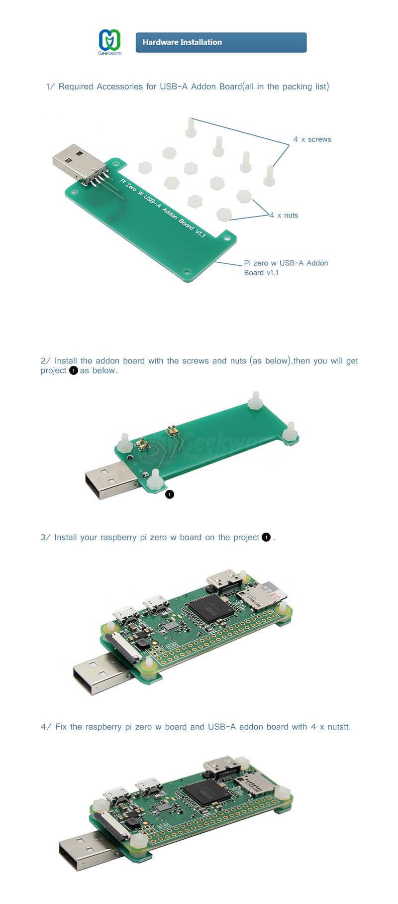
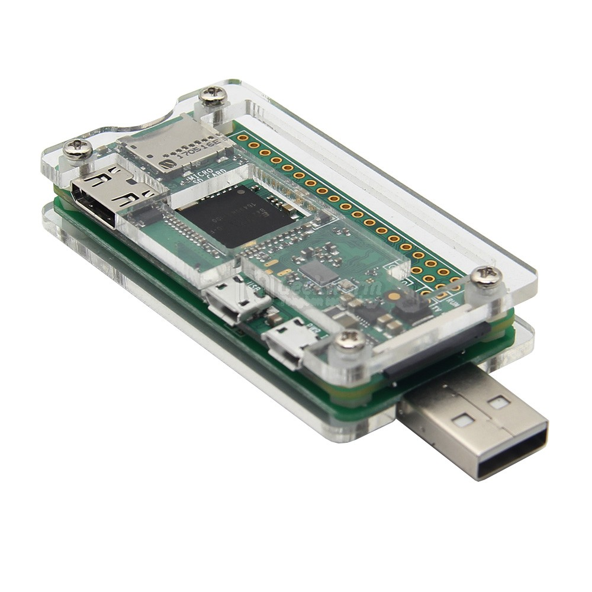
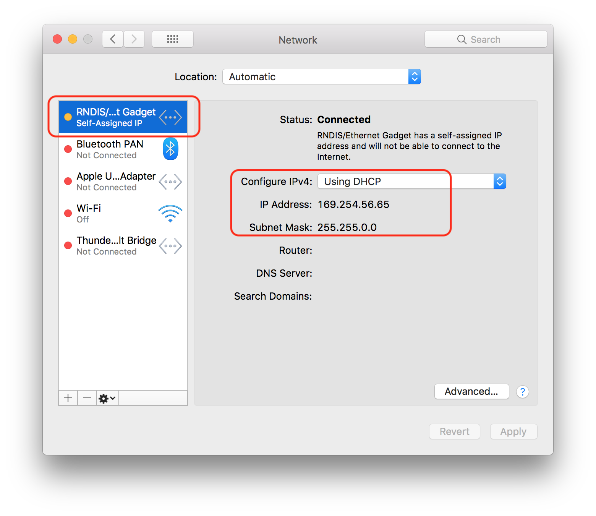
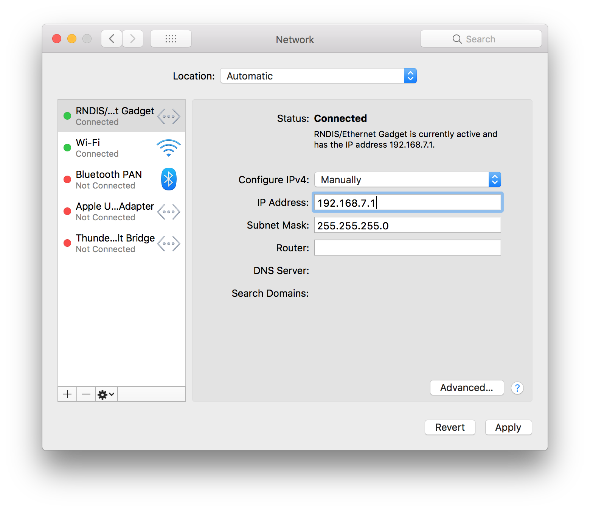
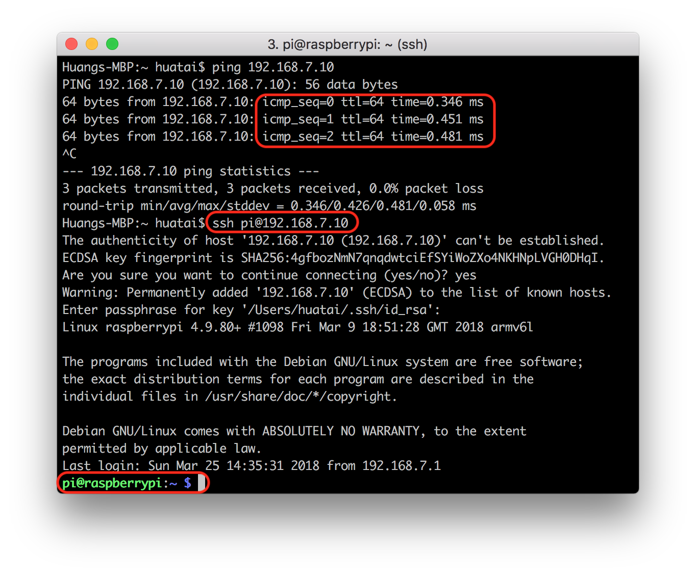

`Ethernet Gadget`是一个可以用于树莓派通过USB micro-B线连接到主机的方法，可以实现网络，VNC，ssh以及scp等操作。

> 虽然名为`Ethernet Gadget`，实际上并不使用以太网线，而只需要使用USB micro-B连线连接主机和Raspberry Pi Zero。此时 `Pi` 就像一个以太网设备。

淘宝上有一种Raspberry pi zero专用的USB扩展板，可以直接将Zero转换成通过标准USB接口取电和同时通讯，方便了使用和携带：



加上一个透明的亚克力保护壳，非常美观：



当网络连接后，可以通过USB线将主机的网络共享给 `Pi`。

* 首先[将树莓派Raspbian安装到TF卡中](raspberry_pi_quick_start)

* 编辑`config.txt`，在最后添加一行：

```
dtoverlay=dwc2
```

* 编辑`cmdline.txt`在`rootwait`之后加上一个空格，以及`modules-load=dwc2,g_ether`。完整配置如下：

```
dwc_otg.lpm_enable=0 console=serial0,115200 console=tty1 root=PARTUUID=5e878358-02 rootfstype=ext4 elevator=deadline fsck.repair=yes rootwait modules-load=dwc2,g_ether
```

* 激活树莓派的SSH登陆功能：

只要在`/boot`分区中有一个空白的`ssh`文件存在，树莓派`Raspbian`系统启动时候就会启动SSH服务。

* 将TF卡插入Raspberry Pi Zero设备，然后通过USB连接到主机上。此时Pi Zero会被识别成一个以太网设备。例如，在Mac已经支持了Bonjour（对于Linux系统，需要添加Bonjour支持），则立即看到网络设备。对于Windows主机，则需要添加Bonjour支持（[添加bonour zoneconf网络](https://learn.adafruit.com/bonjour-zeroconf-networking-for-windows-and-linux/)）

> 不过，此时Raspberry Pi是动态IP地址，所以除非能够在你的Bonjour网络设备上启动DHCP服务，否则无法和对端通讯。



* 设置树莓派Zero静态IP

将树莓派的TF卡通过转接套转成U盘，插入到可以识别EXT4文件系统的Linux主机上。然后在Linux主机上挂载TF卡的`/dev/sdX2`分区（这里`X`是指动态识别的磁盘设备编号，通常可能是`/dev/sdb2`）

```
mount /dev/sdb2 /mnt
```

然后编辑挂载的TF卡分区`/dev/sdb2`上的Raspbian的配置文件

一种方式是编辑`/mnt/etc/network/interfaces`配置如下

```
allow-hotplug usb0
iface usb0 inet static
        address 192.168.7.10
        netmask 255.255.255.0
        network 192.168.7.0
        broadcast 192.168.7.255
        gateway 192.168.7.254
```

另一种方式是编辑`/mnt/etc/dhcpcd.conf`（这是当前推荐的方法）

```
interface usb0
static ip_address=192.168.7.10/24
static routers=192.168.7.1
static domain_name_servers=192.168.7.1
```

这样启动Raspberry Pi Zero就会自动将USB网卡配置固定IP地址。也就是可以在对应的主机上，将网卡IP配置成`192.168.7.1`，就可以和Pi Zero的IP`192.168.7.10`互相通讯了。



此时在Mac上可以ping通Pi Zero所配置的IP地址，也能通过ssh登陆访问：



> 这里我配置了Raspberry Pi的密钥登陆，只要输入私钥保护密码，就可以直接登陆Pi Zero

# 参考

* [Ethernet Gadget](https://learn.adafruit.com/turning-your-raspberry-pi-zero-into-a-usb-gadget/ethernet-gadget)