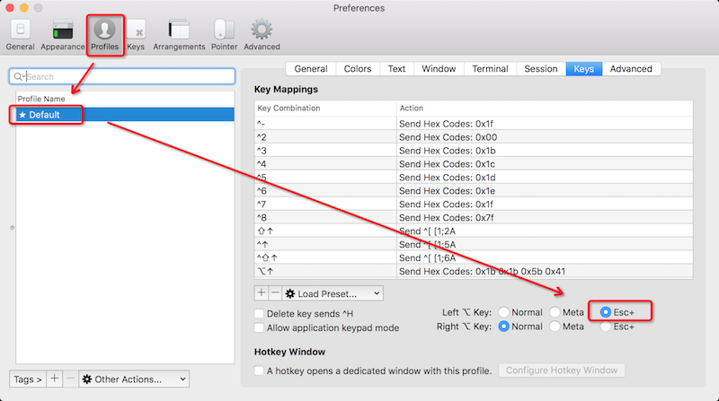

> 要提高工作效率，使用快捷键是必须的！！！

我使用linux很多年，也就是说，使用shell也很多年了。但是一直没有很好利用bash快捷键，浪费了很多时间。现在，我决定系统整理一下快捷键，时时练习，期望节约自己的生命。

# 基本移动方法

* 光标每次移动一个字符
  * 向前移动一个字符： `ctrl+f`
  * 向后移动一个字符： `crtl+b`

> 光标的单个字符移动没有什么优势，和左右箭头键没啥区别

* 删除当前单词： `ctrl+d` (这个功能在Mac上很实用，因为Mac`del`键实际是Windows的`Backspace`键，所以没法删除光标所在当前字符)

* 删除光标前字符： `Backspace`

* 撤销（Undo）：`ctrl+-`

> 这个功能非常重要，可以撤销误删除掉字符

# 快速移动

> 大杀器来了！！！

* 移动到行首： `ctrl+a`

* 移动到行尾： `ctrl+e`

* 向前移动一个单词： `Meta+f`

> `Meta`键就是`Alt`键，在Mac上就是`option`键

在Mac平台，如果实用iTerm2终端软件，需要做键盘映射 （参考iTerm2的[Q: How do I make the option/alt key act like Meta or send escape codes?](https://www.iterm2.com/faq.html)）

`Preferences->Profiles`，选择你的profile，然后再选择`Keys`，在右下角选择`Option`键对应的特性，修改成`Esc+`就可以。

* 向后移动一个单词： `meta+b`

* 清空屏幕： `ctrl+l`

# 复制（kill）和粘贴（yank）

* 剪切从当前光标到行末： `ctrl+k`

* 剪切当前光标到单词末尾： `Meta+d`

* 剪切当前光标到单词开头： `Meta+Backspace`

* 剪切当前贯标到上一个空格： `ctrl+w`

* 粘贴最近一次剪切文本： `ctrl+y`

* 循环并粘贴最近剪切的文本： `Meta+y`（在`ctrl+y`之后实用）

* 循环粘贴前一个命令的最近实用参数： `Meta+.`

# 搜索命令历史

* 使用 `ctrl+r`搜索
* 搜索最近搜索的内容，连按2次`ctrl+r`
* 结束当前历史搜索：`ctrl+j`
* 终止搜索恢复原先行内容: `ctrl+g`

# 参考

* [Shortcuts to move faster in Bash command line](http://teohm.com/blog/shortcuts-to-move-faster-in-bash-command-line/)