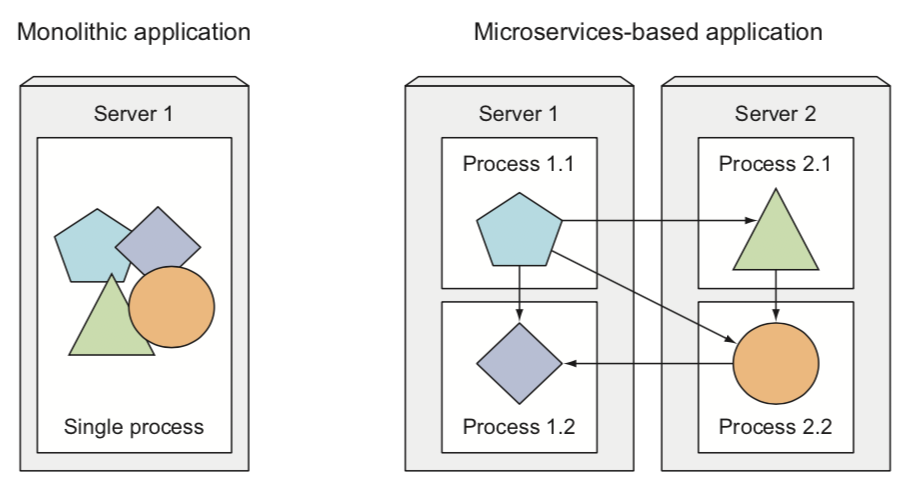
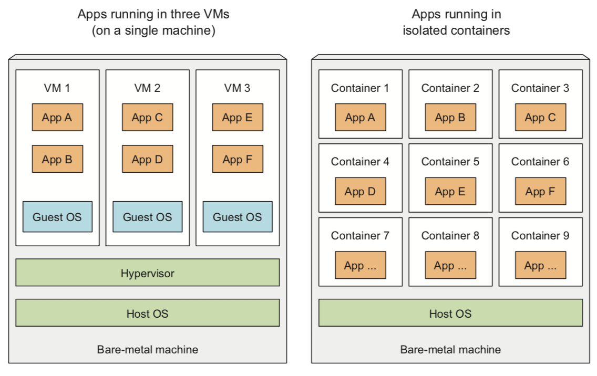
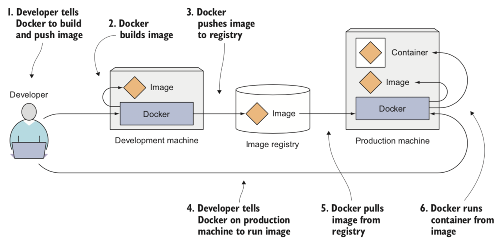

对于维护海量的服务器，不管是物理服务器、虚拟机还是容器，如何实现标准化和自动化，始终是开发、运维人员最为关注的事情。只有标准化才能自动化，但是每个开发者和运维人员对于标准化和自动化的理解是不同的，难以传承和兼容。Kubernetes是面向容器技术的标准化和自动化的解决方案，提供了一整套部署、监控、故障自动处理、调度和弹性伸缩的解决方案。

Kubernetes抽象了硬件架构并将整个数据中心作为一个单一的、庞大的计算资源。当你部署和运行软件时，你不需要关注实际底层运行在哪个服务器上。通过Kubernetes部署多组件应用时，Kubernetes会为每个组件选择一个服务器来部署组件，并且使得组件之间相互通讯。对于开发者而言，Kubernetes就是一个单一平台。

# 应用部署趋势 - 微服务

现代化的软件体系，例如互联网公司的网站，需要运行数以千计的应用才能支持起业务。如何将怪兽（量）级的应用程序作为一个整体进行开发、部署、维护和管理，就好像它们是一个单一的操作系统进程？

想象一下，如果一个应用程序的一个小模块进行更新，就要完整重新部署整个应用程序，对于上述这样"巨型"应用程序，是无法实现的。

解决的方法是将应用拆分成大量功能单一（专注）的应用模块，通过标准化的部署方式部署到不同的应用服务器（集群）上，这样任何一个模块的更新，只需要更新对应应用集群。而且，如果某个模块如果负载发生变化，不论是负载增大或降低，都很容易对该应用集群进行横向扩展或收缩。

随着容器技术的迅速发展，原先基于操作系统来部署应用的方式逐步转变成面向应用来部署容器。开发者不再关注操作系统的部署和升级，而是根据应用运行所依赖的环境来定制容器。容器不需要完整的操作系统环境，也就降低了资源消耗，同时更便于分发和部署。

微服务非常适合在容器中实现，两者都是从服务（或者说应用）角度来思考，将服务模块部署到分布式的容器中，并通过标准接口互相协作，实现完整的应用功能，对开发和运维带来了巨大的便利：

微服务之间通讯采用以下两种方式：

* 同步协议，如HTTP，通常使用RESTful API
* 异步协议，如AMQP（Advanced Message Queueing Protocol, 高级消息队列协议）

这些协议是简洁而且被大多数开发者所熟知的，并且不限定开发语言。每个微服务都可以使用合适的开发语言实现，而通过标准协议进行交互。

虽然在微服务架构出现之前，在很多大型网站的架构部署中，已经采用了应用拆分，分布式部署。但是，微服务架构进一步发展成：

* 每个微服务只是一个提供相应标准扩展API的独立进程，不再是一个复杂的揉合的软件包
* 所有拆分成微服务的软件模块，拆分后的微服务相互间通讯必定是标准API，以完全排除对环境的依赖
* 微服务独立且分离部署，所以每个微服务更新(change)和重新部署(redeploy)将不会要求其他微服务变更
* 当出现某个微服务由于业务负载变化而需要scale时，对该微服务的扩展(scale out)或收缩(scale in)对整个应用体系无依赖
* 从微服务角度出发来思考容器，所以容器必然不需要完整大而全的操作系统，只需要仅仅够运行微服务的容器

微服务的理念带来了应用部署的巨大飞跃，但是也带来的海量的、可以任意分布在数据中心不同服务器上的进程（容器），随之而来是困难和挑战；

* 跟踪调用和调试难度加大，因为这些调用跨多个进程和服务器
* 原先运维视角只是数量有限的软件模块，现在则是数量巨大的进程，而且是分散的进程，已经不可能通过手工登陆服务器来一一排查处理
* 软件模块拆分成微服务不仅带来部署的变革，也带来开发的变革：由于微服务的独立性，所以不同的微服务往往是由不同的独立软件团队开发，可以使用不同的语言、库，版本

带来的优势：

* 从开发环境到线上生产，容器+微服务提供了一致的应用运行环境（相同的操作系统、库、系统配置、网络环境）
* 和DevOps理念的结合：时刻就绪的容器运行环境使得开发者可以专注开发，系统管理员可以专注提供标准环境 - DO WHAT THE DO BEST

# 从虚拟化到容器

虚拟化每个vm是完整的操作系统，具有虚拟化的硬件资源，可以使用不同的内核（或操作系统）。运行在虚拟机中的应用程序会调用guest操作系统的内核，而guest操作系统内核再通过hypervisor来执行物理主机CPU的x86指令集。

在容器环境，所有执行的系统调用都是用相同的内核，也就是运行在Host OS的内核，这个单一内核直接执行x86指令，此时CPU不需要做任何虚拟化。所有容器只不过是Host OS中的一个隔离进程。这带来了性能提升，同时也降低了安全隔离性。

## 企业内部微服务适合容器

微服务的部署架构并不是仅仅能够部署在容器中，实际上，也可以部署在虚拟机中，甚至可以部署在物理机中（如果能够有这么多恰好满足要求且不浪费资源的物理主机）。但是目前技术发展趋势，容器是部署微服务最好的隔离技术：

* 虚拟化技术使得物理服务器资源可以更为灵活划分使用，但是带来了虚拟化的开销浪费了资源；在可以接受的安全隔离等级降低情况下，容器技术避免了虚拟化开销，使得服务器资源尽可能充分利用
  * 微服务对软件的拆分带来了巨量的运行环境要求，如果采用虚拟化支持微服务，硬件资源浪费是惊人的
  * 虚拟化的复杂技术使得运维成本上升（虚拟化技术包含了大量的硬件模拟技术）
* 当前巨型互联网公司、大型企业，其运行环境是可控的、规范和单一化的，例如纯Linux运行环境或纯Windows运行环境，使得容器技术可以实现（不需要在Linux上运行Windows系统或相反）轻量级的隔离
* 对于企业内部，安全性保障是采用综合措施，例如结合外部网络设备隔离，控制内部应用部署隔离（高安全要求应用不会和低安全应用共同部署），使得微服务之间的安全隔离要求降低，也就更为有利于容器技术的应用

## 公有云环境适合虚拟化

公有云环境面向Internet，面向不同的用户使用，需要防范来自各方的攻击和恶意使用，此时虚拟化技术的高安全性、高隔离性则比容器技术有较大的优势。

虚拟化技术可以使用不同的内核、不同的操作系统，通过Intel硬件的不同运行RING级别隔离，实现强安全性。

# 容器技术

容器技术实际上就是操作系统的进程隔离技术，依赖于Linux操作系统内建的特性：

* Linux Namespace - 确保每个进程只能看到自己个人视图的系统（文件、进程、网络接口、主机名等）
* Linux Control Groups(cgroups) - 限定进程能够使用的资源（CPU、内存、网络带宽等）

## Linux Namespace

Linux包含以下namespace:

* Mount(mnt)
* Process Id(pid)
* Network(net)
* Inter-process communication(ipc)
* UTS
* User ID(user)

每个名字空间类型用于隔离一组资源。例如，UTS名字空间决定了进程运行在指定等主机名和域名。通过指定进程的不同的UTS namespaces，可以让进程看到不同的本地主机名。

类似，进程所属的网络名字空间决定了进程中运行的应用程序能够使用的网络接口。每个网络接口属于一个明确的namespace，但是可以从一个namespace移动到另一个namespace。每个容器有自己的Network namespace，这样每个容器就会具有格子的网络接口。

## Linux Control Groups(cgroups)

物理资源的使用限制通过cgroups来实现，一个进程不能使用超过分配的资源（CPU、内存、网络带宽）

# Docker

Docker是一个打包、发布和运行应用程序的平台，融合了容器技术的标准化平台：

* 镜像（Images） - 镜像就是包含了应用程序和运行应用程序所需要的环境的打包，包含了文件系统和执行的元数据
* 仓库（Registries） - Docker Registry是存储Docker images和易于分发镜像的元数据平台
* 容器（Containers） - 从Docker image创建的Linux容器，运行在主机上的进程，这个进程和host主机隔离，也和运行在该主机上的其他进程隔离

## 镜像层（image layers）

> 参考 [About storage drivers](https://docs.docker.com/storage/storagedriver/)

Docker存储驱动允许在容器中创建可写层数据，这种层次存储的文件在容器删除之后会丢失，并且读写速度很低。持久化数据和要提高读写性能需要使用卷存储。

# Kubernetes 功能

* Kubernetes Service

* Kubernetes是分布式系统，基于容器技术的分布式架构
  * 多层次安全防护
  * 多租户应用支持
  * 透明的服务注册和服务发现
  * 内建负载均衡
  * 故障自动发现和自动修复
  * 服务滚动升级
  * 在线扩容
  * 克扩展资源自动调度
  * 多种粒度的资源配额管理

# Kubernetes 概念

* 服务 Service
  * 唯一命名
  * 具有虚拟机IP（Cluster IP, Service IP 或 VIP）以及端口号
  * 提供远程服务能力
  * 映射到提供服务能力的一组容器应用

Service服务目前基于Socket通讯方式对外提供服务（Redis, Memcache, MySQL, Web） 或者具体业务的特定TCP Server进程。Service通常由多个相关服务进程来提供服务，每个服务进程都有独立的Endpoint (IP+Port) 的访问点。

Kubernetes提供Service（虚拟Cluster IP + Service Port）对外提供访问入口，通过内建的负载均衡和故障恢复机制，量

# 参考

* [Kubernetes设计架构](https://www.kubernetes.org.cn/kubernetes%E8%AE%BE%E8%AE%A1%E6%9E%B6%E6%9E%84)