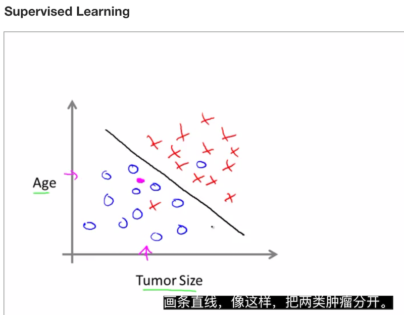

# 监督学习定义

对于部分数据集已经有正确答案，给出一个算法，算出更多正确答案。

监督学习分两类：

* 回归： 离散的数据中预测出这类连续值（例如预测销售额）
* 分类： 离散的数据预测数据分类（例如预测肿瘤是良性还是恶性）

举例：

* 肿瘤良性判断分类
  * 不同属性离散值（患者年龄、肿瘤大小、肿瘤细胞大小、细胞形状一致性等因素），推测肿瘤性质

神奇的监督学习：处理无穷多个特性 （如何支持大量数据的存储和处理？） => 向量机 简洁的数学算法能让电脑处理无限多的特征

对于监督学习，每个数据都有正确的答案（训练集），算法就是基于训练集来做预测