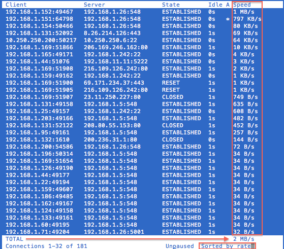

## TCPtrack

### 安装`tcptrack`

```
wget http://pkgs.fedoraproject.org/repo/pkgs/tcptrack/tcptrack-1.4.2.tar.gz/dacf71a6b5310caf1203a2171b598610/tcptrack-1.4.2.tar.gz
tar xfz tcptrack-1.4.2.tar.gz
cd tcptrack-1.4.2
./configure
make
sudo make install
```

> 在CentOS编译，需要先执行 `sudo yum install libpcap-devel`
>
> 安装后执行程序位于`/usr/local/bin/tcptrack`

### 使用`tcptrack`

`tcptrack`使用非常简单，只要具有`root`权限执行，带上`-i <interface>`参数就可以在指定接口上开始抓包分析，实际使用语法

```
Usage: tcptrack [-dfhvp] [-r <seconds>] -i <interface> [<filter expression>] [-T <pcap file]
```

* `-r`

默认情况下，如果网络连接关闭2秒以后，`tcptrack`就会移除显示，不过可以通过`-r`参数来修改，例如调整成5秒以后再移除

```
tcptrack -i eth0 -r 5
```

* `-d`

默认情况下，`tcptrack`会尝试跟踪启动时已经存在的连接。要避免跟踪启动时已经存在的连接，可以使用`-d`参数

```
tcptrack -i eth0 -r 5 -d
```

* `-p`

默认情况下，`tcptrack`会将接口设置成混杂模式（promiscuous），要避免混杂模式，则使用`-p`

* 交互命令 - 启用`tcptrack`之后，会进入交互模式，此时可以按以下键切换模式
  * `p` - 暂停/恢复 显示
  * `s` - 切换使用3种排序模式：非排序（默认），按照速率排序（sorted by rate），按照字节排序（sorted by bytes）。其中按照速率排序比较实用。
  * `q` - 退出程序



* `-f` - 表示`fast average speed`算法。TCPTrack将通过使用运行平均来计算连接的平均速度。TCPTrack将消耗更多的内存和CPUshijian，但是平均值可以更接近实时并且比每秒一次的更新更及时，并且在沉重的网络负载下更为精确。每秒采样次数将在快速平均模式下重新计算，默认是每秒采样10次进行平均。

> 实践发现在大流量的服务器上，需要使用`-f`参数，观察似乎更接近实际流量。

* `-T` - 从文件读取，此时将尽可能快速展示已经通过tcpdump抓包的文件中的性能分析，例如：

```
tcptrack -T network.pcap port  > network.txt
cat network.txt
```

* 常用的过滤规则方法

```
tcptrack -i eth0 'ip dst 192.168.25.34 and port (80 or 443 or 21)'
tcptrack -i eth0 'port (443 or 80)'
tcptrack -i eth0 'dst port 80'
tcptrack -i eth0 'dst port 22'
tcptrack -i eth0 'src or dst 87.xx.xx.18'
```

## 使用`tcptrack`分析网络流量

既然我们要分析导致千兆物理网卡拥塞的原因，就需要分析网络流量中的端口（协议/服务）以及对应的IP对，以便找到流量burst的根源。

* 下载对应的`tcptrack`

RHEL/CentOS 5

```
curl -o /usr/bin/tcptrack http://060307-pub.oss-cn-hangzhou-zmf.aliyuncs.com/tcptrack_5
chmod 755 /usr/bin/tcptrack
```

RHEL/CentOS 7

```
curl -o /usr/bin/tcptrack http://060307-pub.oss-cn-hangzhou-zmf.aliyuncs.com/tcptrack_7
chmod 755 /usr/bin/tcptrack
```

* 分别开两个终端针对`eth0`网卡和`eth1`接口（网卡bonding)进行分析

```
tcptrack -i eth0 -f host 10.181.240.64

tcptrack -i eth1 -f host 10.181.240.64
```

对于大量的网络流量，存在的问题是`tcptrack`太消耗资源了，只能在单核运行`tcptrack`会无法分析所有的网络流量，并导致分析不完整。特别是`sort by rate`，可以看到明显的流量计算偏差，导致计算的Total比实际的网络流量小很多（显示流量只有实际流量1/20甚至更低）。

* （`本方法测试没有成功`）所以在高负载网络，采用先抓包存文件，然后再使用`tcptrack`分析抓包文件

```
tcpdump -s 0 -i eth0 -nn -xX -w network.pcap host 192.168.24.64
tcptrack -T network.pcap > network.txt
cat network.txt
```

> 但是，也存在一个问题，就是输出是没有排序的，但是无法查看到关键的信息。目前只能**暂时放弃使用`tcptrack`分析流量**

# 参考

* [TCPTrack - Simple TCP Connection Monitor](http://www.draconyx.net/articles/tcptrack-simple-tcp-connection-monitor.html)
* [Monitor tcp connections/trafic with tcptrack on RHEL/ CentOs 5.x](https://tournasdimitrios1.wordpress.com/2011/02/12/monitor-tcp-connectionstrafic-with-tcptrack-on-rhel-centos-5-x/)