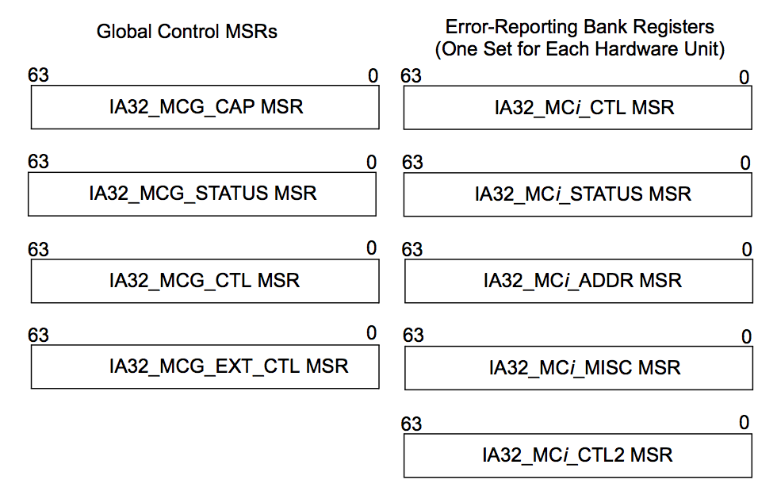
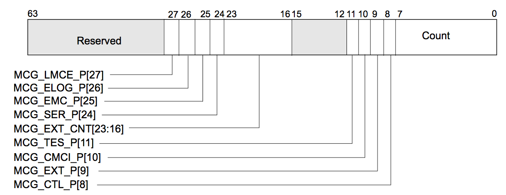

> [Intel® 64 and IA-32 Architectures Software Developer Manuals](https://software.intel.com/en-us/articles/intel-sdm)的第15、16章

# Machine-check架构

Pentium 4, Intel Xeon 和 P6家族的处理器实现了一个主机检测架构（machine-check architecture）来提供一种检查和报告硬件（machine）错误的机制，例如：系统总线错误，ECC错误，奇偶错误（parity errors），缓存错误，以及TLB错误。MCE包含了一系列型号特定寄存器（model-specific registers, MSRs）用于设置主机检测以及额外的MSRs组用于记录检查到的错误。

处理器通过生成一个主机检测异常（machine-check exception），也就是放弃类异常，来记录检测到的不可修复主机检测错误。主机检测架构的实现并通常不是在产生一个machine-check exception时候允许处理器重启。然而，主机检测异常处理器可以从machine-check MSRs搜集有关主机检测错误的信息。

从45 nm Intel 64 处理器开始CPUID报告DisplayFamily_DisplayModel作为 `06H_1AH`，处理器就可以报告有关主机检测错误的信息并发送一个可编程中断给软件以相应MC错误，引用为修正的主机检测错误中断（CMCI）。

Intel 64处理器支持主机检查架构和CMCI也可以支持一个附加的增强，可命名的，支持从一些不正确的可修复主机检测错误的软件修复。

# Machine-check MSRS

在Pentium 4, Intel Atom, Intel Xeon 和 P6系列有一组全局控制和状态寄存器以及一系列错误报告寄存器组。



每个错误报告组和一个特定硬件单元（或一组硬件单元）相关联。使用`RDMSR`或`WRMSR`来读取或写入这些寄存器。

## Machine-Check全局控制MSRs

主机检测全局控制MSRs包括`IA32_MCG_CAP`，`IA32_MCG_STATUS`和可选的`IA32_MCG_CTL`以及`IA32_MCG_EXT_CTL`。

### `IA32_MCG_CAP` MSR

`IA32_MCG_CAP` MSR是一个提供有关处理器的主机检测架构信息的只读寄存器，以下是寄存器的布局：



> 这个`IA32_MCG_CAP`提供了处理器的检测功能的描述，也就是读取这个寄存器就可以知道处理器所支持的MCG功能。详细的位说明见手册。

### `IA32_MCG_STATUS` MSR

`IA32_MCG_STATUS` MSR描述了当一个MCE发生以后处理器的当前状态


* `RIPV (restart IP valid) flag, bit 0` - 是否可重启指令指针所引用指令（restart IP valid)标志：这个寄存器位设置时，程序可以可靠地重启这个指令指针引用的压入堆栈的指令。当这个位寄存器位清除时，程序不能可靠地重启压入指令指针所引用指令。
* `EIPV (erro IP valid) flag, bit 1` - 是否准确表示指令指针引用的指令：这个寄存器位设置时，表示MCE发生时，这个指令指针指向的堆栈中的指令是和错误直接相关的。如果这个标志位没有设置，则指令指针有可能和错误无关。
* `MCIP (machine check in progress) flag, bit 2` - 标记是否产生了machine-check exception(MCE)。软件可以设置或清除这个标志位。当发生第二次Machine-Check Event(MCE)时候，如果这个MCIP被设置了，则会导致处理器进入shutdown状态。
* `LMCE_S (local machine check exception signaled), bit 3` - 标记是否发生了一个本地machine-check exception(MCE)。这个标志位设置的时候就宝石这个MCE异常只发生在本逻辑处理器上。

> `IP` 即 `instruction pointer` 指令指针

### `IA32_MSG_CTL` MSR

当`IA32_MCG_CAP` MSR的`MCG_CTL_P`寄存器位被设置时，则`IA32_MCG_CTL` MSR可以使用。

`IA32_MCG_CTL`控制了是否报告主机检测异常（machine-check exceptions, MCE)。如果设置，写入 1s 到这个寄存器激活machine-check功能，并写入所有 0s 关闭machine-chek功能。所有其他数值都是没有定义也没有实现。

### `IA32_MCG_EXT_CTL` MSR

当`IA32_MCG_CAP` MSR的`MCG_LMCE_P`寄存器位被设置时，则`IA32_MCG_EXT_CTL` MSR可以使用。

`IA32_MCG_EXT_CTL.LMCE_EN` (bit 0)允许处理器发送一些MCE信号给系统只有一个单一逻辑处理器。

如果在`IA32_MCG_CAP` 的 `MCG_LMCE_P` 没有设置，或者平台软件没有通过设置`IA32_FEATURE_CONTROL.LMCE_ON` (bit 20)激活`LMCE`，则任何尝试写或者读`IA32_MCG_EXT_CTL`将导致进入`#GP`。 这个`IA32_MCG_EXT_CTL`寄存器在重置时候被清除。

以下是 `IA32_MCG_EXT_CTL` 寄存器布局


* `LMCE_EN (local machine check exception enable) flag, bit 0` - 系统软件设置这个位允许硬件发送一些MCE信号只给一个单处理器。只在平台软件已经配置`IA32_FEATURE_CONTROL`时候系统软件才可以设置`LMCE_EN`。

### 激活Local Machine Check

准备使用LMCE需要同时配置平台软件和系统软件。平台软件可以通过设置`IA32_FEATURE_CONTRL` MSR(MSR地址3AH) 位20(LMCE_ON)来启用`LMCE`。

系统软件必须确保同时 `IA32_FEATURE_CONTROL.Lock`(bit 0)和`IA32_FEATURE_CONTROL.LMCE_ON`(bit 20)在设置`IA32_MCG_EXT_CTL.LMCE_EN`(bit 0)之前已经设置。当系统软件激活LMCE，则硬件将检测是否有一个特别错误可以只发送给一个单一的逻辑处理器。软件不会假设何种类型错误，硬件可以选择作为LMCE发送。

### 错误报告寄存器组

错误报告寄存器组可以包含`IA32_MCi_CTL`，`IA32_MCi_STATUS`，`IA32_MCi_ADDR`和`IA32_MCi_MISC` MSRs。这个报告组的数量是在`IA32_MCG_CAP` MSR(地址0179H)的`[7:0]`位设置。第一个错误报告寄存器（`IA32_MC0_CTL`）总是以地址`400H`开头。

### `IA32_MCi_CTL` MSRs

`IA32_MCi_CTL` MSR控制关于由部分硬件单元（或者硬件单元组）产生的#MC的信号。64位（EEj）的每个位表示一种潜在的错误。设置一个EEj标志激活相应错误的#MC信号，而清除这个位则关闭这种错误的信号。错误日志则会忽略这些寄存器位的设置。处理器在没有实现的位上放弃写入。


对于P6系列处理器，处理器基于Intel核心微架构（不包括CPUID报告`DisplayFamily_DisplayModel`作为`06H_1AH`以及后续）：操作系统或者决策软件必须`不修改` `IA32_MC0_CTL` MSR寄存器内容。这个寄存器相当于`EBL_CR_POWERON` MSR和控制平台特定错误处理功能。系统特定firmware（BIOS）负责正确初始化`IA32_MC0_CTL` MSR。P6系列处理器只允许写入所有1或者所有0到这个`IA32_MCi_CTL` MSR。

### `IA32_MCi_STATUS` MSRs

每个`IA32_MCi_STATUS` MSR寄存器包含了一个有关主机检测错误的信息，如果这个值(VAL)标记被设置（见下图）。软件负责通过写入`0`明确地清除`IA32_MCi_STATIS` MSRs；然后再写入`1`到`IA32_MCi_STATUS` MSRs寄存器来引发一个一般保护异常（general-protection exception）。

* `MCA`(machine-check architecture) 错误码字段，位`15:0` - 设置主机检测错误情况被发现时的MCA错误码。所有IA-32处理器实现的MCA都是生成相同的MCA定义的错误码。
* `Model-specific`型号相关的错误码字段，位`31:16` - 设置MCE发生时和处理器型号相关的错误码。这个型号相关的错误码在相同的MCE情况下随不同的处理器而变化。
* 保留的，错误状态，和其他信息字段，位`56:32` -
  * 如果`IA32_MCG_CAP.MCG_EMC_P[bit 25]`设置为0，则位`37:32`包含了"其他信息"是特定的并且不是MCE相关的信息。
  * 如果`IA32_MCG_CAP.MCG_EMC_P`设置为1，则`36:32`就是"其他信息"。如果位`37`是0，则系统firmware不能修改`IA32_MCi_STATUS`，如果位`37`是1，则系统firmware可能已经修改了`IA32_MCi_STATUS`内容。
  * 如果`IA32_MCG_CAP.MCG_CMCI_P[bit 10]`设置为0，位`52:38`也包含"其他信息"（和`37:32`位相同)


> `IA32_MCi_STATUS` MSR 位`54:53` 标记了系统架构是否正确报告了MCE时间的硬件状态跟踪，其中`01`表示`绿色`提供了事件状态跟踪，`10`表示`黄色`同样也提供了事件状态跟踪（准确度级别低些？），如果是`00`则表示没有对这个事件提供硬件状态跟踪。

* PCC(processor context corrupt)，位`57` - 这个寄存器位设置表示处理器状态可能已经被检测到的错误情况所破坏并且可能不能可靠重启处理器。
* ADDRV(`IA32_MCi_ADDR`寄存器校验)标志，位`58` - 这个寄存器位设置表示`IA32_MCi_ADDR`寄存器保存了错误发生时的地址。如果被清除，这个位表示`IA32_MCi_ADDR`寄存器要么不支持要么没有包含错误发生时的地址。
* MISCV (`IA32_MCi_MISC`寄存器校验)标志，位`59` - 这个寄存器位设置表示`IA32_MCi_MISC`寄存器保存了错误发生时的地址。
* EN(错误激活)标志，位`60` - 表示通过辅助的`IA32_MCi_CTL`寄存器的EEj位来激活错误。
* UC(错误不可修复)标志，位`61` - 这个寄存器位设置表示处理器不能修复错误情况。如果这个位被清除，则表示处理器可以修复错误。
* OVER(主机检测溢出，machine check overflow)标志，位`62` - 这个位设置表示前一个错误仍然在错误报告寄存器组（也就是VAL位仍然在`IA32_MCi_STATUS`寄存器中设置）时，又发生了一个主机检测错误。处理器设置`OVER`标志，并且软件负责清理该寄存器位。总的来说，激活的错误将覆写禁用的错误，不可修复错误将覆写可修复错误。不过，不可修复的错误不会覆写前一个不可修复的错误。当`MCG_CMCI_P`被设置，修正的错误可能不会设置`OVER`标志。软件可以依靠在`IA32_MCi_STATUS`[52:38]的错误技术来决定是否增加的可修复错误发生。
* VAL(`IA32_MCi_STATUS`寄存器校验)标志，位`63` - 这个位设置表示`IA32_MCi_STATUS`寄存器信息是否正确。如果这个标志位设置，处理器将遵循在`IA32_MCi_STATUS`寄存器中的`OVER`标志给出的规则来覆写前一个校验值。处理器设置这个VAL标志位，而软件负责清除它。

### 主机检查溢出（Machine Check Overflow）的覆写规则

以下是缓存中已经记录了事件到MC bank的时候如何处理第2个事件的覆写规则 - 即MC bank的valid位已经设置成1的时候如何处理：

| First Event | Second Event | UC bit | Color | MCA Info |
| ---- | ---- | ---- | ---- | ---- |
| 00/green | 00/green | 0 | 00/green | either |
| 00/green | yellow | 0 | yellow | second error |
| yellow | 00/green | 0 | yellow | first error |
| yellow | yellow | 0 | yellow | either |
| 00/green/yellow | UC | 1 | undefined | second |
| UC | 00/green/yellow | 1 | undefined | first |

----

> 在["NETDEV WATCHDOG: slave0 (bnx2): transmit queue 5 timed out"内核Panic排查](os/linux/kernel/cpu/bnx2_transmit_queue_timeed_out_intremap_off)中我们提到了有关MCE错误的排查，本文将综合一些MCE排查的经验和相关技术纲要。

* [污染的内核(tainted kernel)是什么意思](tainted_kernel)

当出现machine check exception (MCE) 的时候，硬件出现问题，此时会设置一个`taint state`（污染状态），一旦设置了内核`已经污染`(`tainted`)，则只能通过重启系统重新加载内核才能unset这个污染状态。

# Machine Check Exceptions (MCE)

主机检测异常是通过主机的CPU处理器检测到的错误。有2种主要的MCE错误类型：警告类错误(notice or warning error)，和致命异常（fatal exception）。

* 警告类错误(notice or warning error)将通过一个"Machine Check Event logged"消息记录到系统日志中，然后可以通过一些Linux哦你工具事后查看。
* 致命异常（fatal exception）则导致主机停止响应，MCE的详细信息将输出到系统的控制台。

# System Management BIOS (SMBIOS)

System Management BIOS (SMBIOS)规范𨈖已了用于读取存储在主机BIOS中的信息的数据结构（和访问方法）。这个规范是[分布式管理工作组](https://en.wikipedia.org/wiki/Distributed_Management_Task_Force)(Distributed Management Task Force, DMTF)的一个子集。在集成之前，SMBIOS功能称为DMIBIOS，这是因为它是和桌面管理接口（Desktop Management Interface, DMI）交互的。

在Linux内核包含了一个SMBIOS解码器，允许系统管理员检查系统硬件配置并激活或禁用一些特定系统来修复问题，这个方法是基于SMBIOS信息。用户命令工具`dmidecode`和这个检查这个内核数据。通常信息包含了系统生产厂商、型号、序列号、BIOS版本和资产标签，以及很多和系统生产厂商相关的各种信息。这些信息通常包含了针对CPU sockets，扩展插槽（包括AGP, PCI, ISA）以及内存模块查抄，以及I/O端口列表（包括串口，并口和USB）。

## 哪些会导致MCE错误

常见的MCE错误原因包括：

* 内存错误或ECC(Error Correction Code)问题
* 冷却不充分/处理器过热
* 系统总线错误
* 处理器或硬件的缓存错误

## 如何查看MCE错误信息

如果在控制台或者系统日志中看到"Machine Check Events logged"，可以运行`mcelog`命令从内核读取信息。一旦你运行过`mcelog`，你就不能再运行`mcelog`来查看错误，所以最好将程序输出到文本文件，这样以后还可以分析，例如：

```
/usr/sbin/mcelog > mcelog.out
```

一些系统会周期性执行mcelog并将输出信息记录到文件 `/var/log/mcelog`。所以如果你看到"Machine Check Events logged"消息但是`mcelog`没有返回任何数据，请检查`/var/log/mcelog`。

## 模拟/触发 Machine Check Exception

`mcelog`在[test suite](http://mcelog.org/README.html)提供了一个称为`mce-inject`的工具，[源代码](https://github.com/andikleen/mce-inject)编译`sh make test`

## 分析致命的MCE

一些致命的MCE通常是硬件故障。需要捕获MCE消息，然后在主机恢复以后通过`mcelog`程序分析，以下是一个线上宕机的控制台输出

```
2016-12-21 16:07:49    [2592938.163474] [Hardware Error]: CPU 6: Machine Check Exception: 0 Bank 8: 88000040000200cf
2016-12-21 16:07:49    [2592938.163513] Clocksource tsc unstable (delta = -17179860571 ns).  Enable clocksource failover by adding clocksource_failover kernel parameter.
2016-12-21 16:07:50    [2592938.414712] [Hardware Error]: TSC 0 MISC 98873a2000043000 
```

将MCE错误信息记录到文本`mce_error`如下

```
CPU 6: Machine Check Exception: 0 Bank 8: 88000040000200cf
TSC 0 MISC 98873a2000043000 
```

然后执行

```
mcelog --ascii < mce_error
```

解析显示是内存的可纠正错误（corrected error）

```
Hardware event. This is not a software error.
CPU 6 BANK 8
MISC 98873a2000043000
MCG status:
MCi status:
Corrected error
MCi_MISC register valid
MCA: MEMORY CONTROLLER MS_CHANNELunspecified_ERR
Transaction: Memory scrubbing error
STATUS 88000040000200cf MCGSTATUS 0
```

现在我们来分析上文宕机故障中控制台输出的MCE错误消息

```
CPU 19: Machine Check Exception: 4 Bank 5: be00000000800400
TSC 7ebbc5c7e698b4 ADDR 1579aa6 
PROCESSOR 0:206c2 TIME 1480763330 SOCKET 0 APIC 11
CPU 7: Machine Check Exception: 4 Bank 5: be00000000800400
TSC 7ebbc5c7e698c8 ADDR 1579aa6 
PROCESSOR 0:206c2 TIME 1480763330 SOCKET 0 APIC 10
Machine check: Processor context corrupt
```

通过`mcelog`分析输出可以看到

```
Hardware event. This is not a software error.
CPU 19 BANK 5 TSC 7ebbc5c7e698b4
MISC 0 ADDR 1579aa6
TIME 1480763330 Sat Dec  3 19:08:50 2016
MCG status:MCIP
MCi status:
Uncorrected error
Error enabled
MCi_MISC register valid
MCi_ADDR register valid
Processor context corrupt
MCA: Internal Timer error
STATUS be00000000800400 MCGSTATUS 4
CPUID Vendor Intel Family 6 Model 44
SOCKET 0 APIC 11
Hardware event. This is not a software error.
CPU 7 BANK 5 TSC 7ebbc5c7e698c8
MISC 0 ADDR 1579aa6
TIME 1480763330 Sat Dec  3 19:08:50 2016
MCG status:MCIP
MCi status:
Uncorrected error
Error enabled
MCi_MISC register valid
MCi_ADDR register valid
Processor context corrupt
MCA: Internal Timer error
STATUS be00000000800400 MCGSTATUS 4
CPUID Vendor Intel Family 6 Model 44
SOCKET 0 APIC 10
Machine check: Processor context corrupt
```

# 原理


# 参考

* [What are Machine Check Exceptions (or MCE)?](http://www.advancedclustering.com/act-kb/what-are-machine-check-exceptions-or-mce/)
* [怎样诊断Machine-check Exception](http://linuxperf.com/?p=105)
* [Decoding Machine Check Exception (MCE) output after a purple screen error (1005184)](https://kb.vmware.com/selfservice/microsites/search.do?language=en_US&cmd=displayKC&externalId=1005184)
* [Intel® 64 and IA-32 Architectures Software Developer Manuals](https://software.intel.com/en-us/articles/intel-sdm)的[Intel® 64 and IA-32 Architectures Software Developer’s Manual Volume 3A: System Programming Guide, Part 1](https://software.intel.com/sites/default/files/managed/7c/f1/253668-sdm-vol-3a.pdf)详细介绍了Machine-Check Architecture原理和排查方法（第15、6章）
