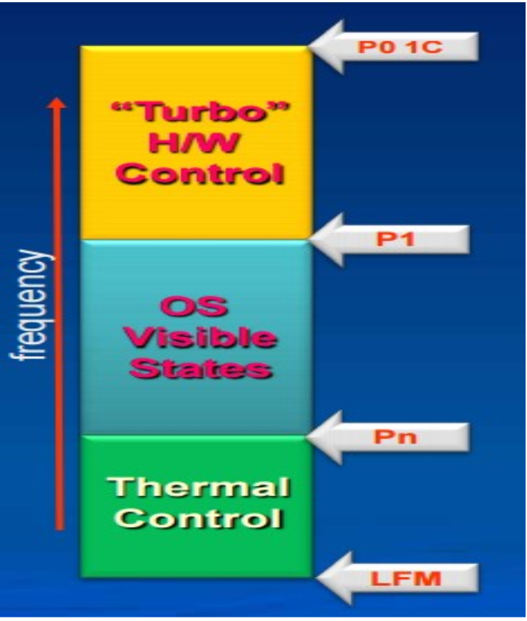
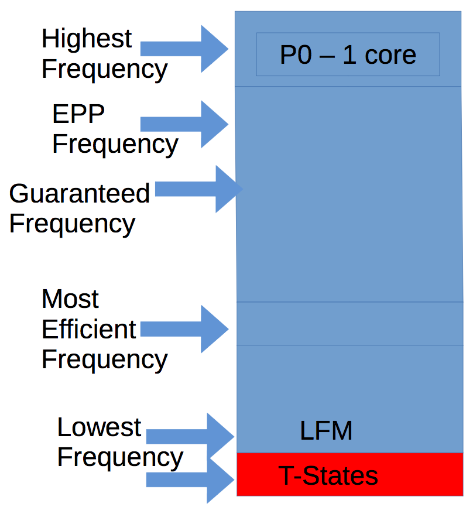
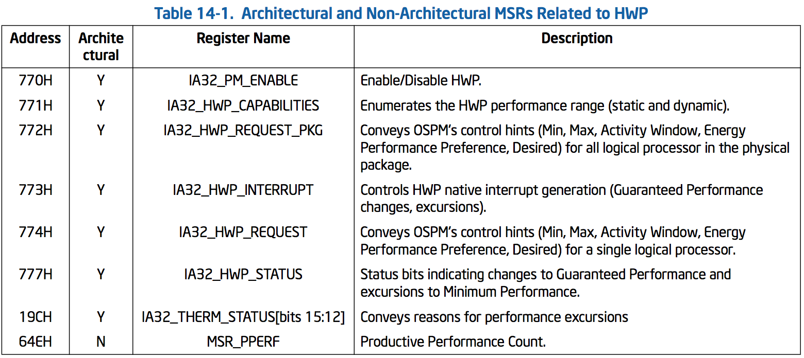
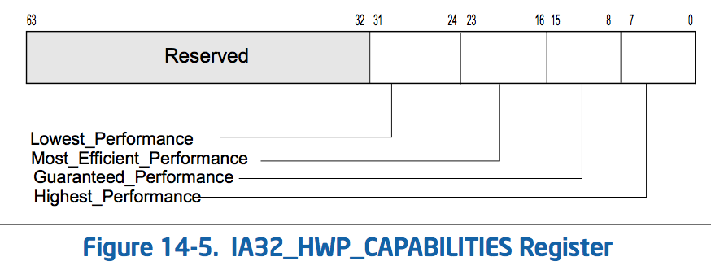

# P-state

> 本段落为[Balancing Power and Performance in the Linux Kernel](https://events.linuxfoundation.org/sites/events/files/slides/LinuxConEurope_2015.pdf)概要摘录

`P-state`是CPU频率和操作点电压的结合。

处理器性能和主频是直接相关的。增加主频可以增加处理器性。反之，即哪个低主频则降低性能。如果将主频减半，计算任务就会降低一半速度。不过，如果降低主频，但是增加CPU使用率并且降低idle时间百分比，则会影响电池使用时间。

引入`P-state`的两个主要原因是：降低尖峰时热能负载，以及降低能耗。

# Linux内核的能耗和性能平衡

## idle的不同级别

* runtime idle
* suspended
* off

## 激活电源管理

* CPU激活电源管理（cpufreq） - P-states 或 DVFS
* 设备激活电源管理 - 一些设备支持PCIe ASPM
* GPU则自我管理

## 选择正确的p-state

* 调节器(Governors)反映了用户策略决定：
  * `intel_pstate`只支持`powersave`和`performance`策略，其他驱动支持更多策略。
  * `intel_pstate`是一个调节器，并且hw驱动是一个整体，所以传统上这个governor是和hw驱动隔离的。
* `intel_pstate` "performance" 策略总是选择最高的`p-state`
  * 完全不考虑节能
* `intel_pstate` "powersave" 策略尝试平衡性能和节能
* `intel_pstate`驱动监视使用率并能够决定何时增加或减少`p-state`。这个方式和其他governors类似。

# `p-state`划分

* `P0 - P1` 是 turbo范围
* `P1 - Pn` 是 保证范围（操作系统可见的状态）
* `Pn - LFM` 是 温度控制范围

# P-state的硬件协作

* 共享相同电压域的CPU核心对一个`p-state`投票
* 每个CPU核心的最高`p-state`赢得投票
* APERF/MPERF必须用于查看哪个`p-state`被批准

> `acpi_cpufreq`已经被废弃

# P-state的操作系统限制

* 能力/使用率不足以决定何时伸缩
* 采样率可能导致不正确的使用计算
* 伸缩性的收益不明确

# 硬件P-state(HWP)

Intel Speed Shift Technology (HWP)

* 最有效的主频是运行时计算（Pe） - 基于系统和负载
* EPP表示Energy Performance Perference（能源执行性能优先） - 将决定如何强化算法（Pa） - 基于系统，负载，OS
* 算法将在Pa和Pe之间操作

> `HWP`即 Hardware P-State

# Linux实现

* `intel_pstate`驱动检查CPU flag
* 默认所有白名单CPU都激活
* 只支持自动模式
* 没有EPP输出
* Min和Max pstate是通过min和max perf_pct sysfs文件获取

----

# Intel P-State驱动

> 本段落翻译自内核`intel_pstate`驱动说明文档[cpu-freq/intel-pstate.txt](https://www.kernel.org/doc/Documentation/cpu-freq/intel-pstate.txt)，解释了[Balancing Power and Performance in the Linux Kernel](https://events.linuxfoundation.org/sites/events/files/slides/LinuxConEurope_2015.pdf)详细信息。

理解`cpufreq` core governors(cpufreq核心调节器)和策略对于讨论Intel P-state驱动非常重要。基于一个`cpufreq`驱动提供给`cpufreq`核心的回调(callback)，支持一下两种驱动：

* `target_index()`回调：这种模式下，驱动使用`cpufreq core`简单提供了最小和最大主频限制以及一个附加的`target_index()`接口来设置当前主频。`cpufreq`子系统有一系列伸缩策略（`performance`，`powersave`，`ondemand`等）。基于所使用的governor调节器，`cpufreq core`将使用`target_index()`回调来转换到值指定主频。
* `setpolicy()`回调：这种模式下，驱动不提供`target_index()`回调，所以`cpufreq`核心不能请求一个特定频率的转换。驱动提供最小和最大频率限制，然后回调设置一个策略。这个调节器策略在`cpufreq` sysfs系统中被称为"scaling governor"。`cpufreq`核心可以请求驱动来操作两个策略之一：`performance`和`powersave`。驱动基于这两个策略的选择来决定使用的频率以确定最小和最大主频限制。

Intel `P-State`驱动程序属于后一类，它实现了`setpolicy()`回调。

# 启动激活Intel P-State

> 见[Intel Turbo boost和p-State](intel_turbo_boost_and_pstate)

# 参考

* [Balancing Power and Performance in the Linux Kernel](https://events.linuxfoundation.org/sites/events/files/slides/LinuxConEurope_2015.pdf) - Intel开源中心提供的有关能耗和性能平衡的介绍文档
* [cpu-freq/intel-pstate.txt](https://www.kernel.org/doc/Documentation/cpu-freq/intel-pstate.txt) - 内核`intel_pstate`驱动说明，也是[Balancing Power and Performance in the Linux Kernel](https://events.linuxfoundation.org/sites/events/files/slides/LinuxConEurope_2015.pdf)的一个完整阐述
* [What exactly is a P-state](https://software.intel.com/en-us/blogs/2008/05/29/what-exactly-is-a-p-state-pt-1)
* Intel developer's Manual: Chapter14 - power and thermal management
* [Power management architecture of the 2nd generation Intel Core microarchitecture formerly codenamed Sandy Bridge](http://www.hotchips.org/wp-content/uploads/hc_archives/hc23/HC23.19.9-Desktop-CPUs/HC23.19.921.SandyBridge_Power_10-Rotem-Intel.pdf)