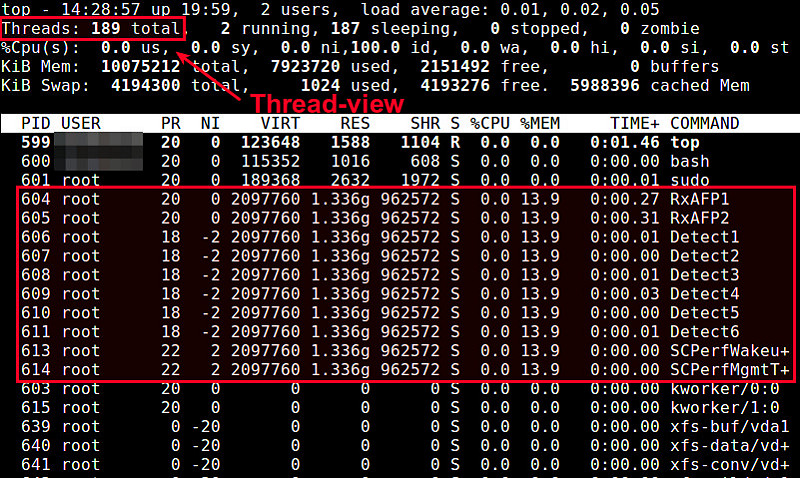
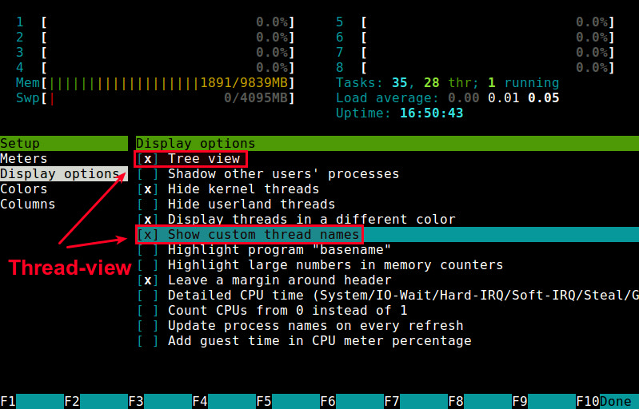
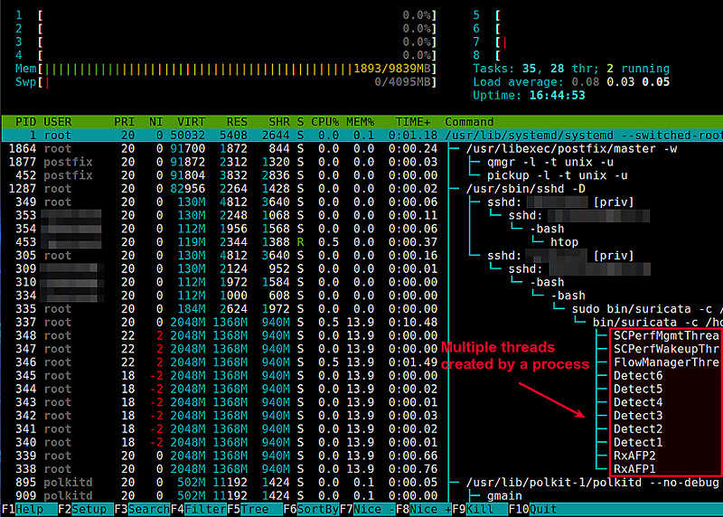

线程是现代操作系统中并行执行的常用编程抽象，线程是在一个程序内部多个流执行的，共享资源（例如，内存地址，打开的文件等）以最小化forking overhead和降低IPC(进程间通讯)开销。

在Linux中，线程也称为轻量级进程（Lightweight Processes, LWP）使用相同的线程组ID作为程序的PID。对于Linux内核调度器，线程和标准的进程没有区别，只不过共享资源。经典的命令行工具，如`ps`和`top`默认显示的是进程级别信息，但也可以显示线程级别信息。

# `ps`显示线程

```
ps -T -p <pid>
```

# `top`显示线程

`top -H`可以显示线程，另外也可以通过`-p`参数指定显示某个进程的线程情况。

```
top -H
```



```
top -H -p <pid>
```

# `htop`显示线程

`htop`启动后按下`<F2>`按按键可以进入设置惨淡，选择`Setup`列的`Display option`，然后启用`Three view`和`Show custom thread names`，然后按下`<F10`退出设置：



就可以看到详细的线程信息



# 参考

* [How to view threads of a process on Linux](http://ask.xmodulo.com/view-threads-process-linux.html)