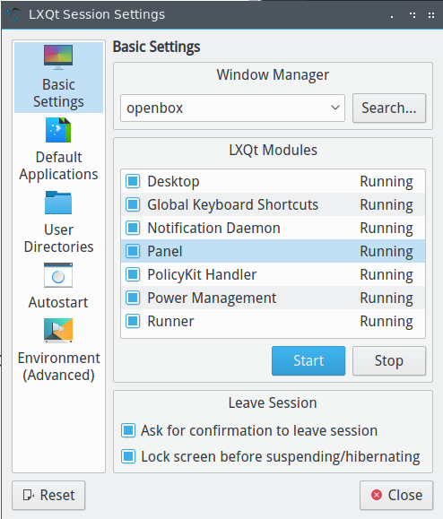

在LXQt桌面中，如果需要定制自己的启动菜单，例如，通过`.tgz`包安装了Android Studio，需要建议一个启动菜单。

`Menu-plugin`是[LXPanel](https://wiki.lxde.org/en/LXPanel)的一个组件，遵循[freedesktop.org](http://freedesktop.org/)标准。`Menu-plugin`没有提供图形编辑菜单的功能，主要通过配置文件来完成。

> LXQt是由LXDE发展而来，所以继承了LXDE的设置方法，包括重启`lxqt-panel`的方法也类似。

# `*.desktop`文件

`*.desktop`文件是菜单的配置，位于两个位置：

* `/usr/share/applications`
* `~/.local/share/applications`

简单的配置案例

```
[Desktop Entry]
Encoding=UTF-8
Exec=warsow
Icon=/home/USER/my/icons/wsw-icon_80x80.png
Type=Application
Terminal=false
Name=Warsow
GenericName=warsow
StartupNotify=false
Categories=Game
```

修改完成`*.desktop`文件之后，需要重启`lxqt-panel`进程，可以使用：

```
killall lxqt-panel && lxqt-panel &
```

另外，也可以使用GUI [LXQt Session Settings](https://github.com/lxde/lxqt-session#lxqt-session-settings)



如果是LXDE环境，则可以使用`lxpanelctl`指令

```
lxpanelctl restart
```

# 参考

* [LXDE Main Menu](https://wiki.lxde.org/en/Main_Menu)
* [HELP: How can lxqt-panel refresh the menu after it has been edited? #1178](https://github.com/lxde/lxqt/issues/1178)