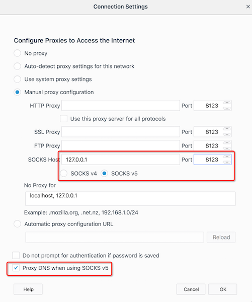

# ssh端口转发

ssh端口转发提供了强大的天然安全加密通道（tunnel），甚至不需要搭建复杂的VPN，就可以凭借一台ssh服务器作为网管，自由翻墙访问资讯。

在系统维护工作中，ssh也是最为强大的工具，不仅提供了远程服务器的终端访问，而且提供了通过`port forwarding`功能实现文件传输复制、远程桌面访问、以及巧妙的组合成本地编辑远程保存的工作方式。

可以通过端口转发方式实现访问本地`localhost`端口通过ssh服务器转发到ssh服务器后面的内部服务器上，相当于iptables的端口转发，但是更为方便简洁。

	ssh yourserver -L 80:reddit.com:80

此时，你访问本地80端口就会访问到`reddit.com`的`80`端口，这对于一些内网防火墙或堡垒机之后的服务器维护会非常方便。

再举个例子，`gateway`是一台堡垒服务器，连接internet，后面隐藏了服务器`web-1`，我需要维护`web-1`

    ssh gateway -L 2201:web-1:22

这样就可以通过`ssh -p 2201 localhost`直接ssh访问到`web-1`系统。

## 通过ssh端口转发实现多跳访问

测试模拟环境中DMZ区服务器上启动了KVM虚拟机安装环境，采用VNC提供访问，VNC只监听在本机回环地址5900。在外部需要通过ssh多跳访问服务器端口

```
127.0.0.1(10.1.44.23,A主机):5900 => 127.0.0.1(10.1.44.11,B主机):5900 => 127.0.0.1(192.168.0.2,C主机):5900
```

A主机执行如下指令登陆B主机：

```
ssh 10.1.44.11 -L 5900:127.0.0.1:5900
```

B主机执行以下命令登陆C主机：

```
ssh 192.168.0.2 -L 5900:127.0.0.1:5900
```

此时可以在主机A上通过VNC客户端访问 127.0.0.1:5900 来访问主机C上的VNC服务安装虚拟机。

> 验证还有问题，待测试

# ssh动态端口转发

```bash
ssh -C -D 8123 SERVER_IP
```

`-D`参数提供了动态转发，也就是连接了服务器之后，本地`localhost`会监听`8123`端口，所有通过socket方式访问本地`8123`端口的流量都会转发到远程服务器，通过远程服务器访问Internet。

## 设置操作系统网络通过socks代理

通过`ssh动态端口转发`可以让firefox这样的浏览器通过socket代理自由访问internet，那么`npm`是否也能这样呢？

然而`npm`不支持socket代理，需要使用第三方的工具，如`dsocks`（BSD/Mac OS X）或者`tsocks`（Linux）

	git clone https://github.com/dugsong/dsocks
	cd dsocks
	make -f GNUMakefile

> 不过，在最新的MacOSX10.11无法完成编译

[proxifiler](https://www.proxifier.com/)提供了在Windows和Mac下的proxy client，价格比较昂贵，需要$39.95。不过，这个软件提供了1个月的试用期，临时使用也足够了。

> `proxifiler`非常好用，提供了每个访问代理的服务进程的监控，可以看到自己客户端每个访问连接和数据流量。此外，提供了一个规则编辑器，可以设置哪些需要代理，哪些不需要代理，确实非常方便使用。

如果简单的代理方式，其实可以使用Mac OS X自己内建代理设置（在网络设置中有个Proxy设置），只是是设置方法不是很清晰。

## 设置Firefox浏览器

Firefox浏览器支持通过 socks 代理访问internet，即可以通过上述ssh动态端口转发先建立加密通道。然后设置Firefox通过加密通道访问internet即可以科学上网。

不过，需要注意的是，`ssh -D`构建的是socks代理，不是`ssl/http/ftp`代理，所以设置Firefox的时候需要去除`ssl/http/ftp`代理配置，只保留`socks`代理配置，否则不能正确工作。

正确设置如下图：



# 参考

* [SSH: More than secure shell](http://matt.might.net/articles/ssh-hacks/)