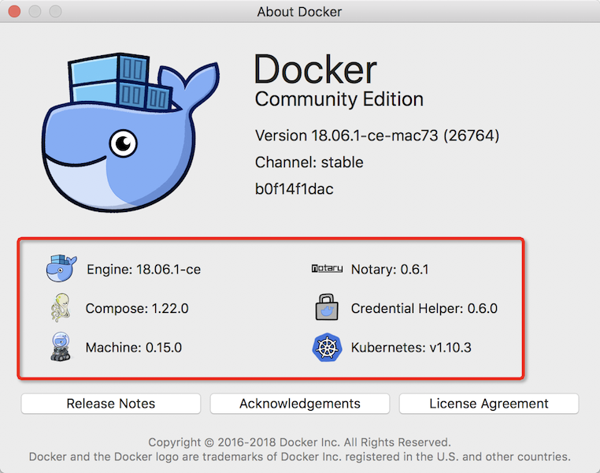

运行Docker for mac的系统需要支持MMU（memory management unit）虚拟化的Intel硬件环境，即需要2010年之后的新硬件以及Mac OS X 10.10.3 Yosemite。

系统要求：

* 需要使用2010年之后的硬件以便支持Intel MMU(memory management unit)虚拟化，例如扩展页表(Extended Page Tables, EPT)和不受限模式（Unrestricted Mode），可以通过以下命令检查主机是否支持：

```
sysctl kern.hv_support
```

* macOS El Capitan 10.11 或更新版本
* 至少4G内存
* 不能安装VirtualBox 4.3.30之前版本（不兼容）

> 如果系统不满足这些要求，可以安装Docker Toolbox，其附带了Oracle Virtual Box来替代HyperKit

# Docker for Mac vs. Docker Toolbox

Docker for Mac HyperKit VM 的运行环境不需要在本地运行Docker Machine nodes(也就是原先使用的VirtualBox虚拟机)，而是使用一种新型的原生虚拟化系统（[HyperKit](https://github.com/docker/HyperKit/)）[xhyve](https://github.com/mist64/xhyve)，可以得到更好的性能：

* 基于macOS 10.10 Yosemite或更高版本操作系统内建的轻量级的Hypervisor framework运行[HyperKit](https://github.com/docker/HyperKit/)
* 和原先Docker Machine所创建的虚拟机无关，从本地`default`主机（如果存在）复制一份容器副本和镜像到Mac Hyperkit VM，不影响原先默认的主机
* Docker for Mac提供了一个基于Alpine Linux的HyperKit VM来运行Docker Engine，直接在`/var/tmp/docker.sock`提供了docker API，这样就不需要设置任何环境变量（默认docker就可使用）直接运行`docker`和`docker-compose`

Docker for Mac包括：

* Docker Engine
* Docker CLI client
* Docker Compose
* Docker Machine
* Kitematic

从Docker Store下载 [Docker Community Edition for Mac](https://store.docker.com/editions/community/docker-ce-desktop-mac)



> 当前最新版本的Docker for Mac已经内建安装了Kubernetes，也可以直接激活使用（通过Docker的Preferences菜单，其中`Kubernetes`页面有激活和设置功能）


# 参考

* [Getting Started with Docker for Mac](https://docs.docker.com/docker-for-mac/)
* [Docker for Mac vs. Docker Toolbox](https://docs.docker.com/docker-for-mac/docker-toolbox/)
* [基于 FreeBSD/bhyve 的虚拟技术 xhyve](https://mba811.gitbooks.io/about-mac/content/Virtual-Technology/xhyve.html)