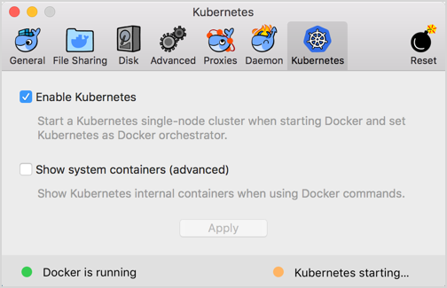

安装完成Docker for mac，检查版本：

```
docker --version
docker-compose --version
docker-machine --version
```

# 探索

## Hello Docker

在命令行运行一个简单的Docker镜像，hello-world

```
docker run hello-world
```

上述命令实际上是一个简单镜像"hello-world"下载，然后从这个镜像创建一个容器，运行后输出终端消息"Hello from Docker!"，然后容器停止。

> 通过 `docker ps -a`可以看到已经关闭的容器

## 运行Docker化的web服务器

```
docker run -d -p 80:80 --name webserver nginx
```

此时使用浏览器访问 http://localhost/ 可以看到 Nginx欢迎页面

详细的容器信息，可以使用命令`docker ps`或`docker container ls`查看

```
docker container ls
```

显示输出

```
CONTAINER ID        IMAGE               COMMAND                  CREATED             STATUS              PORTS                NAMES
ef1a390251a4        nginx               "nginx -g 'daemon of…"   4 hours ago         Up 4 hours          0.0.0.0:80->80/tcp   webserver
```

停止和移除容器（名字是`webserver`）以及镜像方法：

```
docker container ls
docker container stop webserver
docker container ls -a
docker container rm webserver
docker image ls
docker image rm nginx
```

# 设置

Docker for Mac提供了`whale menu -> Preferences`设置，可以调整Docker的使用功能：

* General
  * 在登陆时启动Docker
  * 自动检查升级
  * 在Time Machine备份中包含VM备份
  。。。

* 文件共享 - 选择部分本地目录共享给容器

* Proxies - Docker for Mac可以检测到macOS的HTTP/HTTPS Proxy设置并使用，例如用于pulling containers

例如，当macOS设置了系统proxy，则使用如下命令检查容器环境，可以看到容器也使用了proxy：

```
docker run -it alpine env
```

# Kubernetes

Docker for Mac 17.12 CE(和更高版本)包含一个独立的Kubernetes服务，就可以测试再Kubernetes中测试部署Docker负载。



选择`Enable Kubernetes`之后，会开始安装和启动Kubernetes，即下载Kubernetes服务器的镜像并作为容器运行，以及再Mac中安装了`/usr/local/bin/kubectrl`命令行工具。

在Docker菜单的Kubernetes状态中，会显示context指向`docker-for-desktop`


默认情况下，Kubernetes容器在`docker service ls`的输出中会隐藏起来不显示(实际上比较实用)。不过，也可以选择`Show system containers(advanceed)`，然后点击`Apply and restart`，则可以看到大量的Kubernetes容器在系统中运行。

Kubernetes客户端命令`kubectl`包含了配置本地Kubernetes服务。

```
kubectl config get-contexts
kubectl config use-context docker-for-desktop
```

# Docker Store

在Docker for Mac菜单中选择`Docker Store`就可以通过浏览器访问Docker应用下载:

* Docker EE - 企业版Docker
* Docker CE - 社区版Docker
* Containers - 提供下载镜像
  * Store - 镜像商店，相当于官方提供的镜像，较为可靠，但数量（约250个）和种类有限。常用的OpenSUSE, Ubuntu, CentOS, Fedora 都提供了镜像
  * Community (Docker Hub) - 社区镜像，即以前的Docker Hub，提供了数万个镜像，但是良莠不齐
* Plugins - 插件

# 参考

* [Get started with Docker for Mac](https://docs.docker.com/docker-for-mac/)