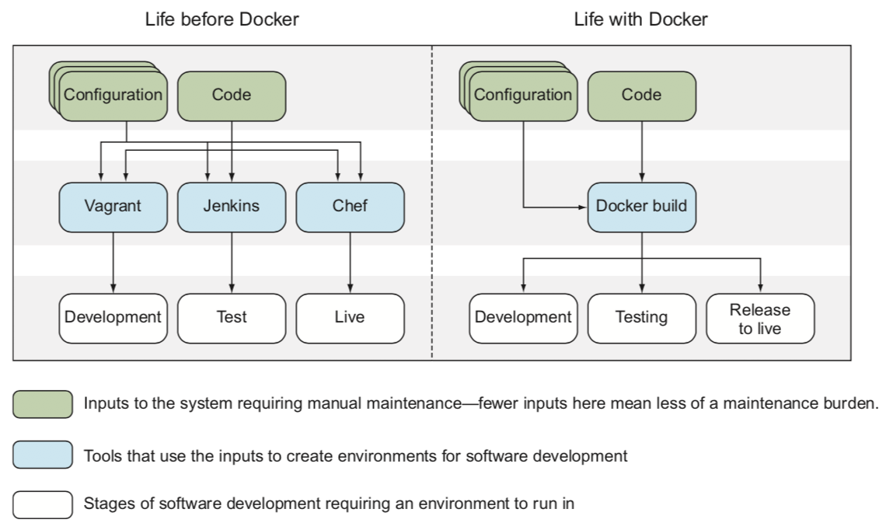

# 容器和虚拟机的差异

虚拟机提供了虚拟机管理程序hypervisor用于创建和运行虚拟机，控制访问底层操作系统和硬件的全县，以及在必要时解析系统调用接口。每个虚拟机需要一个完整的操作系统来运行应用程序以及程序库。

容器是底层操作系统中的一个进程，所以容器只能运行和主机相同的内核。

> 虚拟机与容器都可以把主机上的应用程序隔离开来。虚拟技术中的虚拟机管理程序能带来更高一级的隔离性能，是已被公认且千锤百炼的技术。
>
> 容器技术相对较新，很多公司在取得充分可靠的运行记录前，无法完全信任容器的隔离性能。
>
> 因此，不难发现有些系统同时采用这两种技术，将容器运行在虚拟机内，这样就能鱼与熊掌兼得。

由于 Docker 并非使用虚拟化技术，容器必须与主机的内核一致——Windows Server 的容器只能在 Windows Server 的主机上运行，64 位 Linux 的容器只能在 64 位 Linux 的主机上运行。

# Docker和容器

容器并不是新概念：

* UNIX 系统一直以 chroot 命令来提供简单的文件系统隔离
* 自 1998 年起，FreeBSD 有了 jail 命令，它把 chroot 的沙盒机制扩展至进程
* 2001年，Solaris Zones 提供了一个相对完整的容器化技术，但它只能用于 Solaris 操作系统
* 2001 年，Parallels 公司（当时称为 SWsoft）推出用于 Linux 的商业容器技术，名为 Virtuozzo，并于 2005 年把核心技术开源，称其为 OpenVZ（很久以前，我也曾将尝试过OpenVZ - 需要对内核进行补丁，所以使用受到了限制）
* 谷歌开始为 Linux 内核开发 CGroups 机制，并开始将它的基础设施容器化
* 2008 年，Linux 容器（Linux Containers，LXC）项目启动，它把 CGroups、内核命名空间以及 chroot 等技术融合，提供了一套完整的容器方案
* Docker 于 2013 年补充了当时容器化技术的不足，将容器技术带入主流

Docker 利用现有的 Linux 容器技术，以不同方式将其封装及扩展——主要是通过提供可移植的镜像，以及一个用户友好的接口——来创建一套完整的容器创建及发布方案。

Docker 平台拥有两个不同部分：负责创建与运行容器的 Docker 引擎，以及用来发布容器的云服务 Docker Hub：

* Docker 引擎提供了一个快速且便捷的接口用来运行容器。
* Docker Hub 提供大量的公共容器镜像以供下载，方便用户快速上手，并且避免了重复劳动。

对实施快速迭代开发模式的开发者来说，Docker 容器能迅速启动至关重要，因为他们可以很快看到代码变更后的结果。容器能保障的可移植性及隔离特性，使得开发与运维部门之间更容易协作，因为开发者知道他们的代码在不同环境下都能工作，而运维部门只需专注于容器的托管及服务编排，而无需担心任何关于代码的事。

## Docker带来的DevOps改变

在Docker技术诞生前，DevOps已经存在10年之久（ [A Short History Lesson in DevOps — And Where It’s Going](https://www.bluematador.com/blog/short-history-lesson-devops-where-its-going/) ）。然而，整个开发、部署、持续交付的流程结合了不同的软件和技术，诸如 虚拟机、配置管理工具、软件编译系统、软件包管理系统以及复杂的库依赖。这些工具的组合令人眼花缭乱，需要特定的工程师来维护，并且缺乏统一的解决方案。

[Docker in Practice](https://www.amazon.cn/dp/B079GQV832) 的示意图非常形象：

# 一些Docker产品

* Docker Swarm 是一个 Docker 集群管理工具
* Docker Machine 是个部署 Docker 主机的命令行工具

Docker 1.8 版本引入了“内容信任”（`content trust`）特性，能够核实 Docker 镜像的完整性和发布者身份。对于建立基于 Docker 仓库镜像的可信工作流程，**内容信任**是个很重要的构成部分。

## 其他竞争和相关产品

* CoreOS
* LXC
* FreeBSD提供利用ZFS和Linux兼容层来运行Docker （2015年）
* Docker和微软联合推出在Windows Server开发的Docker Engine

# 微服务

微服务是容器最主要的用例，也是容器技术兴起的最大推动力。

微服务是一种软件系统开发和构成形式，由小而独立的组件组成，这些组件通过网络互相连接沟通。这与传统的`单一架构`（`monolith`）软件开发模式相反，后者只有一个庞大的程序，一般由 C++ 或 Java 实现。

微服务则设计成`横向扩展`（`scale out`），为了满足增长的需求，只需部署多台机器摊分负载即可。微服务架构还可以针对系统中的瓶颈，只扩展某个特定服务所需的资源。

> 以上特征可以看到微服务是适合部署无状态服务的一种架构

**系统复杂度而言，微服务是把双刃剑。每个单独的微服务都应该易于理解和修改，但是，在一个拥有几十到几百个这类服务的系统中，组件之间的交互会导致整体的复杂度增加。**

> 容器具有的轻量级和速度的优势，使得其非常适合微服务架构。

