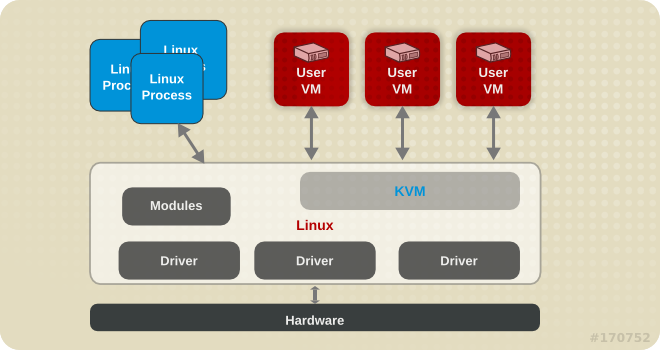

# KVM性能架构

* 使用KVM时候，guest虚拟机作为Linux的进程在主机上运行
* 虚拟CPU(vCPU)作为正常线程运行，由Linux调度器执行
* host主机的磁盘和网络I/O设置对性能影响显著
* 网络流量通过基于软件的网桥传输

## RedHat 7虚拟化性能改进

* 自动化 NUMA 平衡 - 默认启用，改进了NUMA 硬件系统中运行应用的性能，无需guest虚拟机任何手工设置。 自动化 NUMA 平衡把任务（任务可能是线程或进程）移到与它们需要访问的内存更近的地方。
* 多队列 virtio-net - 数据包发送／接收处理与guest中可用的vCPU 数量相协调
* 桥接零复制传输 - 零复制传输模式（Zero Copy Transmit）对主机 CPU 负荷的减少可以达到 15%，且对吞吐量没有影响。(不过默认情况下禁用)
* APIC 虚拟化 - 新型Intel处理器提供高级可编程中断控制器的硬件虚拟化（APICv，Advanced Programmable Interrupt Controller）。APIC 虚拟化将通过允许客机直接访问 APIC 改善虚拟化 x86_64 客机性能，大幅减少中断等待时间和高级可编程中断控制器造成的虚拟机退出数量。
* EOI 加速 - 对在那些较旧的、没有虚拟 APIC 功能的芯片组上的高带宽 I/O 进行 EOI 加速处理。
* 多队列 virtio-scsi - 每个vCPU 都可以使用独立的队列和中断，从而不会影响到其他虚拟 CPU。
* 半虚拟化 ticketlocks
* 半虚拟化页面错误 - 半虚拟化页面错误在尝试访问Host置换页面时将被加入到客机。这一功能改善了Host内存过载和Guest内存被置换时 KVM 的客机性能。
* 半虚拟化时间 vsyscall 优化 - gettimeofday 和 clock_gettime 系统调用将通过 vsyscall 机制在用户空间执行。这样不需要系统切换到kernel模式（再回退到user模式），可以改善部分应用性能

# 参考

* [KVM概述](https://access.redhat.com/documentation/zh-cn/red_hat_enterprise_linux/7/html-single/virtualization_tuning_and_optimization_guide/index)