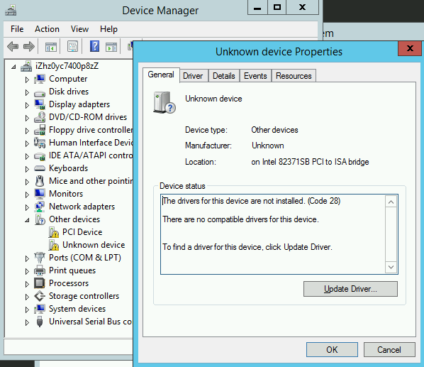
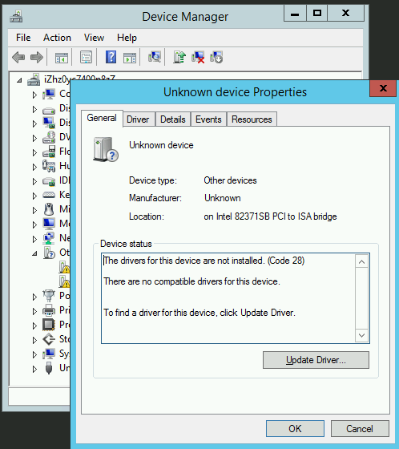
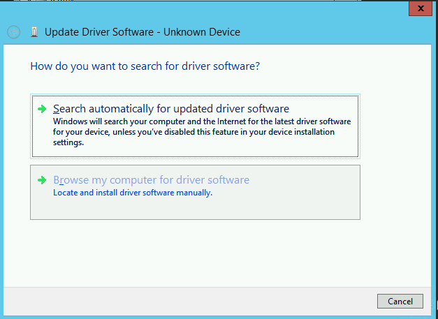
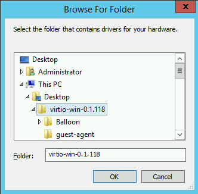
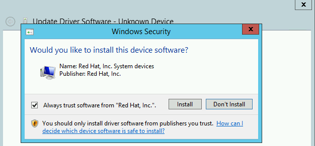
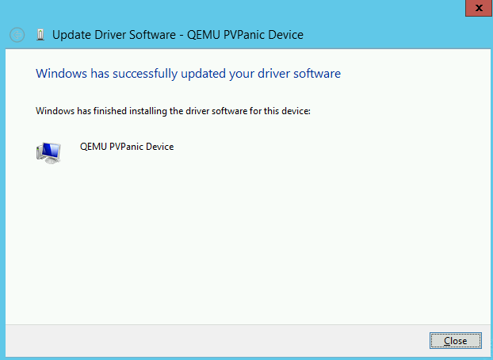
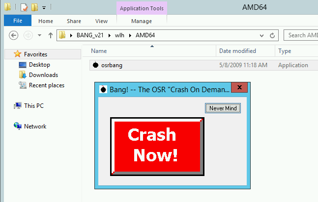

在配置了[libvirt pvpanic](libvirt_pvpanic)虚拟设备之后，QEMU的虚拟机内部会增加一个ISA设备。结合适当的驱动，就可以实现vm内部crash通知到host主机，以便采取相应的处理措施。

> 在测试Windows系统Crash是否能够触发pvpanic事件的关键点是模拟触发Windows crash，其余的环境设置和[CentOS pvpanic实现和测试](centos7_pvpanic)相似。

对于Windows物理服务器，主要有两种方法人工触发Crash来获取memory dump:

* 设置`NMICrashDump`，通过使用一个硬件级别的远程管理接口来触发
* 设置`CrashOnCtrlScroll`，通过特定组合键来触发
* 使用Bang! -- Crash on Demand Utility
* 使用WinDbg

详细请参考[触发Windows Crash（获取memory dump）](../../../os/windows/debug/force_windows_crash)

在虚拟化环境中，主要采用软件方法来触发。

# 触发Windows crash的工具

## BANG

[BANG! -- Crash on Demand Utility](http://www.osronline.com/article.cfm?article=153) 是一个非常简单实用的工具，可以根据不同的Windows版本触发crash。

## WinDbg

[Windows Debugger (WinDbg)](https://developer.microsoft.com/en-us/windows/hardware/download-windbg)可以用于debug内核和用户模式代码，分析crash dump以及检查代码执行时CPU寄存器。

# Windows Virtio驱动

[Fedora Windows Virtio Drivers](https://fedoraproject.org/wiki/Windows_Virtio_Drivers)提供了。

从 virtio-win-0.1.103-2 开始支持 [QEMU pvpanic](https://github.com/qemu/qemu/blob/master/docs/specs/pvpanic.txt)

在Windows guest虚拟机内部可以看到如下ISA设备，但是此时因为操作系统没有安装驱动，所以暂时无法时别。同时，由于没有安装pvpanic设备驱动，Windows CRASH时候也不能传递信息给host主机的libvirtd。

参考[Windows虚拟机virtio驱动版本](../../kvm/virtio/windows_virtio_drivers_version)下载当前已经安装的`virtio-win`的相同版本的iso文件，然后通过 `7-zip` 工具解压缩，然后更新该ISA设备的驱动。

> 这里案例下载了`virtio-win-0.1.118.iso`，通过`7-zip`解压缩成`virtio-win-0.1.118`目录，其中包含了所有`virtio-win`驱动。

* 在`Device Manager`中找到这个ISA未知设备，双击显示设备属性

* 点击`update driver`按钮，然后选择`Browse my computer for driver software`

* 选择已经解压缩的驱动文件目录，然后确认后并且进入下一步驱动搜索

* Windows会自动找到匹配的驱动并提示安装，直接确认进行安装

* 正确安装了驱动之后，则Windows会正确识别出设备`QEMU PVPanic Device`如下：

# 测试

* 在Windows 2012（x86_64）可以选择`vlh\AMD64\osrbang.exe`

运行程序后点击`Crash Now`按钮，此时即发生Windows Crash。并且可以在host物理服务器的`/var/log/libvirt/libvirtd.log`日志中观察到对应的虚拟机`emit panic`日志。