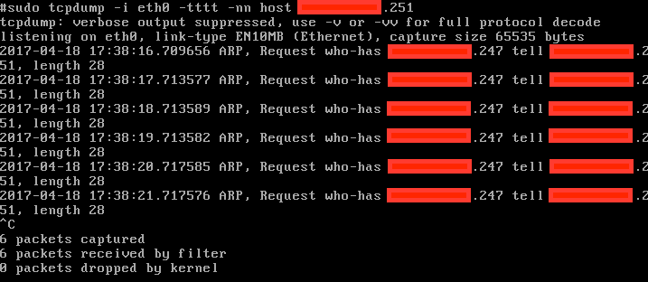

# 故障

用户反馈Linux虚拟机网络突然不通，无法ssh和ping虚拟机IP，只能通过VNC访问虚拟机控制台。

这样的问题我们通常需要检查数据包丢失在网络链路的哪部分，也就是通过`tcpdump`在网络链路不同部分分别抓包以确定丢包的范围，进一步针对性排查故障。

> 本文案例中IP地址是mask的内网IP地址，非实际IP，仅做演示。

# 在网络链路中使用tcpdump

* 在物理服务器上，对连接物理交换端的最边缘物理网卡抓包：

```
sudo tcpdump -i eth0 -tttt -nn  host 192.168.128.251
```

> 这里`host 192.168.128.251`就是虚拟机内部虚拟网卡上分配的IP地址，我们在物理网卡上针对虚拟机IP进行抓包能够知晓到虚拟机的数据包是否到达了对应物理网卡上。

输出显示，所有的数据包只有进入方向访问虚拟机IP `192.168.128.251` 的 22, 80, 443 端口，但是可以看到没有一个返回的外出方向数据包。所以接下来要在虚拟网络链路（分为物理服务器的backend设备和虚拟即内部的frontend设备）进行抓包来确定丢失位置。

```
tcpdump: verbose output suppressed, use -v or -vv for full protocol decode
listening on eth0, link-type EN10MB (Ethernet), capture size 96 bytes
2017-04-18 17:35:43.135478 IP 192.168.148.12.62413 > 192.168.128.251.80: S 1996982089:1996982089(0) win 29200 <mss 1460,nop,nop,sackOK,nop,wscale 9>
2017-04-18 17:35:43.313282 IP 192.168.175.1.39774 > 192.168.128.251.80: S 1419449341:1419449341(0) win 29200 <mss 1460,nop,nop,sackOK,nop,wscale 9>
2017-04-18 17:35:43.561297 IP 192.168.62.193.15229 > 192.168.128.251.80: S 1883040004:1883040004(0) win 14600 <mss 1460,nop,nop,sackOK,nop,wscale 7>
2017-04-18 17:35:43.765200 IP 192.168.24.8.55600 > 192.168.128.251.22: S 3639517383:3639517383(0) win 14600 <mss 1460,sackOK,timestamp 3825997029 0,nop,wscale 7>
2017-04-18 17:35:43.837713 IP 192.168.96.214.3253 > 192.168.128.251.443: S 813802466:813802466(0) win 14600 <mss 1460,sackOK,timestamp 3114265885 0,nop,wscale 7>
```

* 首先要找到物理服务器上虚拟机所使用虚拟网卡在物理服务器中的backend设备名称，这个设备名称可以通过`virsh dumpxml 虚拟机名`来获取：

```
sudo virsh dumpxml 
```

输出显示

```
      <interface type='bridge'>
        <mac address='00:16:3e:02:1f:00'/>
        <source bridge='eth0'/>
        <vport name='cp.021f00'/>
        <pps tx='120000'/>
        <target dev='021f00'/>
        <model type='virtio'/>
        <alias name='net0'/>
        <address type='pci' domain='0x0000' bus='0x00' slot='0x03' function='0x0'/>
      </interface>
```

这里可以看到 `<target dev='021f00'/>` ，即虚拟网卡的backend设备名是`021f00`。

同样，可以使用`brctl show`查看到网络设备连接的虚拟交换机设备

```
sudo brctl show
```

显示输出

```
bridge name	bridge id		STP enabled	interfaces
eth0.700		8000.6c92bf2c621e	no		vlan.700
							...
							021f00
                            ...
```

* 在物理服务器上，对虚拟网络的backend设备`021f00`进行抓包

```
sudo tcpdump -i 021f00 -tttt -nn  host 192.168.128.251
```

同样可以看到在虚拟网卡的物理服务器backend设备`021f00`上也看到外部网络进入的数据包，同样也没有返回的数据包

```
listening on 021f00, link-type EN10MB (Ethernet), capture size 68 bytes
2017-04-18 18:21:13.760859 IP 192.168.96.206.3966 > 192.168.128.251.443: S 624161397:624161397(0) win 14600 <mss 1460,sackOK,timestamp 3118882310[|tcp]>
2017-04-18 18:21:13.814897 IP 192.168.96.198.3072 > 192.168.128.251.443: S 3671821632:3671821632(0) win 14600 <mss 1460,sackOK,timestamp 3118882546[|tcp]>
2017-04-18 18:21:13.851191 IP 192.168.24.8.12399 > 192.168.128.251.22: S 1247678519:1247678519(0) win 14600 <mss 1460,sackOK,timestamp 3828727115[|tcp]>
2017-04-18 18:21:13.884842 arp who-has 192.168.129.247 tell 192.168.128.251
2017-04-18 18:21:13.886118 arp reply 192.168.129.247 is-at 58:6a:b1:e1:47:dc
2017-04-18 18:21:14.546267 IP 192.168.148.12.57508 > 192.168.128.251.80: S 1366876139:1366876139(0) win 29200 <mss 1460,nop,nop,sackOK,nop,wscale 9>
```

* 现在定位数据包已经进入到虚拟机内部，需要排查虚拟机内部是否正常接收数据包

通过VNC登录到虚拟机内部，执行

```
sudo tcpdump -i eth0 -tttt -nn  host 192.168.128.251
```

此时发现只有虚拟机(xxx.xxx.xxx.251)不断发出网关（xxx.xxx.xxx.247）ARP解析请求，但是没有任何其他数据包



这表明在虚拟机内部的操作系统层面出现了驱动异常，导致数据包无法处理。

* 在虚拟机内部通过`ifdown`和`ifup`命令重启网卡设备，或则通过`/etc/init.d/network restart`重启网卡，重新加载网卡驱动


* 重启后，再次抓包即发现数据包实现了双向传输，同时虚拟机网络恢复，可以访问虚拟机。

> 本案例是一个简单的排查方法，主要是在网络链路不同阶段进行数据包tcpdump，缩小故障排查范围。实际在生产环境中，虚拟网络故障非常复杂，这里只是一个小小的起步。